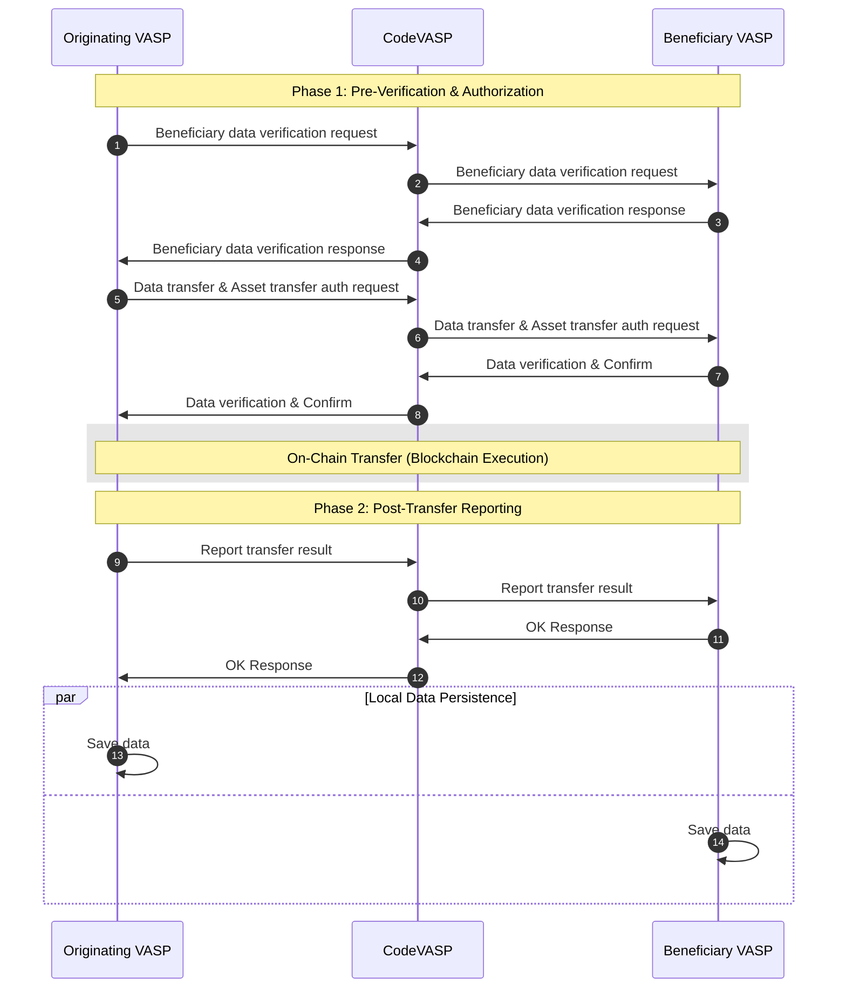
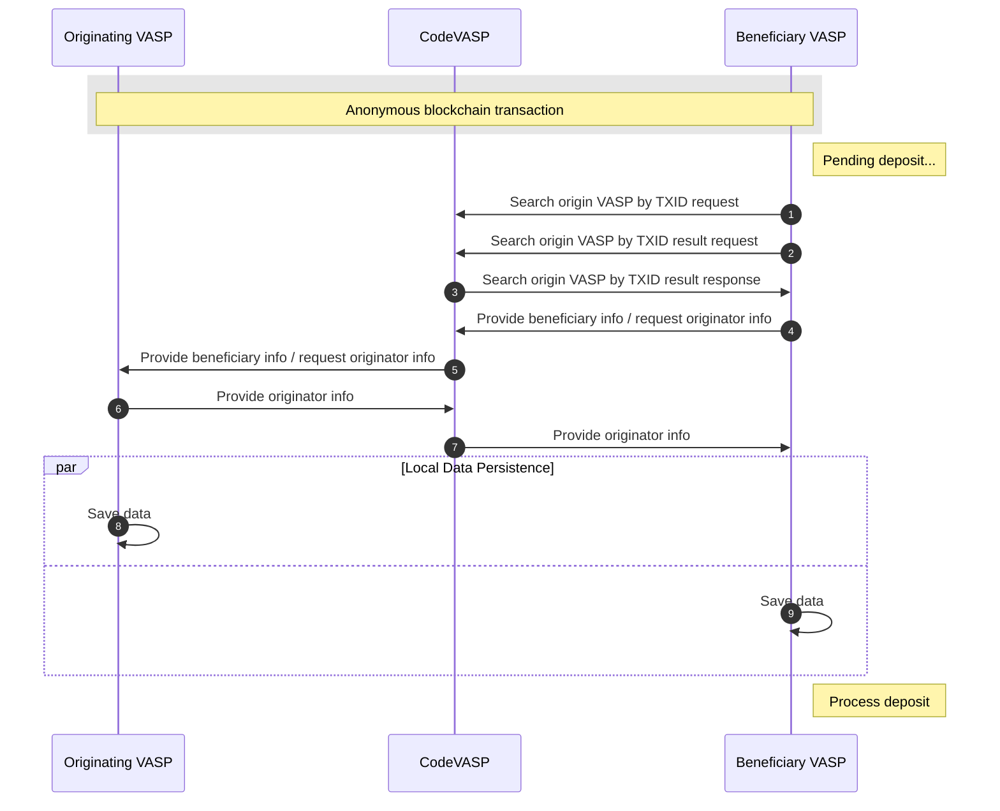

# CodeVASP Introduction

CodeVASP was established as an alliance of Korea’s leading exchanges. Today, it stands as a globally recognized Travel Rule solution with the longest operational track record and proven expertise. With new features such as 'Search VASP by Wallet' and 'Search VASP by TXID,' CodeVASP continues to advance the Travel Rule process and shape emerging global standards.

## CodeVASP Workflow

The Travel Rule communication flow in CodeVASP can be divided into two main types.
### Flow1: Pre-verification

### Flow 2: Post-verification

The first process takes place before an on-chain transfer is executed, where VASPs exchange Travel Rule information in advance and request authorization for the asset transfer. Once the transfer is approved, the on-chain transaction is carried out and the result is also shared.

The second process applies when, for any reason, the pre-transfer information exchange and authorization cannot be completed. In this case, a supplementary procedure ensures that the incoming asset is still handled within the scope of regulatory compliance: the originating VASP is identified based on the TxID, and once the search succeeds, the required information exchange takes place.

## CodeVASP APIs

| API Name                      | Description                                                                                                                                                                                                                                                                                                      |
| :---------------------------- | :--------------------------------------------------------------------------------------------------------------------------------------------------------------------------------------------------------------------------------------------------------------------------------------------------------------- |
| VASP List Search              | The originating VASP sends a request to CodeVASP, and CodeVASP returns a list of VASPs integrated under the Travel Rule. This is typically used to generate the list of available exchanges on the customer withdrawal screen.                                                                                   |
| Public Key Search             | The originating VASP sends a request to CodeVASP, and CodeVASP returns the public keys of VASPs required for encryption.                                                                                                                                                                                         |
| Search VASP by Wallet Request | A VASP sends a request to CodeVASP to search which VASP owns a given wallet address. This request is processed asynchronously.                                                                                                                                                                                   |
| Search VASP by Wallet Result  | A VASP sends a request to CodeVASP to obtain the result of a “Search VASP by Wallet” query.                                                                                                                                                                                                                      |
| Virtual Asset Address Search  | The originating VASP and the beneficiary VASP communicate to verify whether a wallet address belongs to a beneficiary VASP. This step is performed before the transfer to prevent unnecessary exposure of user information.                                                                                      |
| Asset Transfer Authorization  | The originating VASP communicates with the beneficiary VASP to request authorization for the asset transfer.                                                                                                                                                                                                     |
| Report Transfer Result        | The originating VASP and the beneficiary VASP communicate to notify that the transaction has been completed on the blockchain network.                                                                                                                                                                           |
| Transaction Status Search     | The beneficiary VASP communicates with the originating VASP to check the status of a specific transaction. This is typically used when no confirmation is received via the “Report Transfer Result” API within a certain timeframe.                                                                              |
| Finish Transfer               | The originating VASP and the beneficiary VASP communicate to notify that the asset transfer process has been terminated or failed.                                                                                                                                                                               |
| Search VASP by TXID Request   | A VASP sends a request to CodeVASP to identify the originator of an ***anonymous transaction **based on its TXID. This request is processed asynchronously.                                                                                                                                                      |
| Search VASP by TXID Result    | A VASP sends a request to CodeVASP to obtain the entity ID of the originating VASP as the result of a “Search VASP by TXID” query.                                                                                                                                                                               |
| Asset Transfer Data Request   | The beneficiary VASP communicates with the originating VASP regarding an already completed anonymous transaction. Using the “Search VASP by TXID Request” and “Search VASP by TXID Result” APIs, the beneficiary VASP identifies the originator and exchanges the user data required for Travel Rule compliance. |

*anonymous transaction: A blockchain transfer that has been executed without prior Travel Rule information exchange, leaving the originating VASP unidentified until further inquiry.
