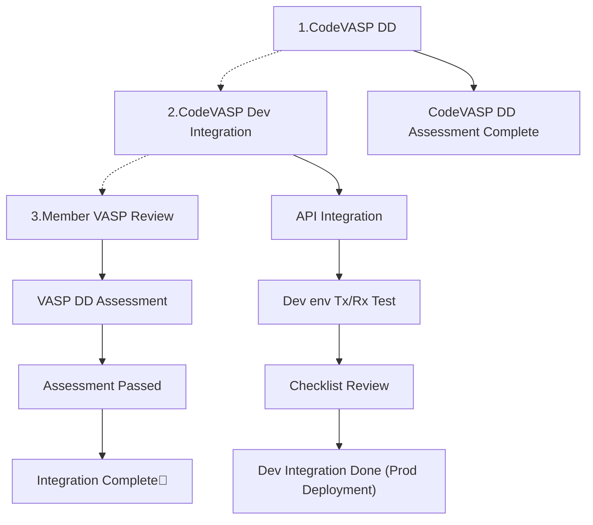
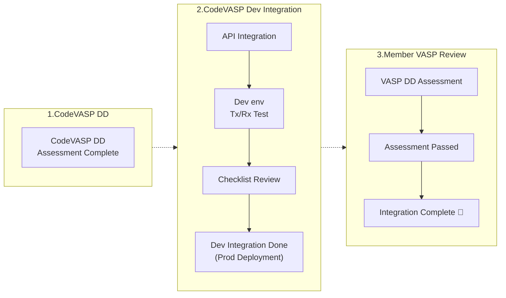

# Integration Process

## 1. CodeVASP DD
CodeVASP conducts our own due diligence on VASPs prior to integration to ensure regulatory compliance and the establishment of a reliable environment. The document submission process for DD is managed through CodeVASP's dashboard. Additionally, we support our member VASPs to carry DD Assessments and document sharing via the CodeVASP Dashboard.

## 2. CodeVASP Dev Integration
Once integration is complete, a transmission and reception test will be conducted in the development environment. For these tests, we verify that the API traffic is functioning properly and ensure that all conditions for Travel Rule compliance are met. Before going live, please review the Integration Checklist. Upon completion of these steps, the system will be deployed to the production environment, making it technically capable of communicating with the CodeVASP Travel Rule Alliance.

## 3. Member VASP Review
Completing the API integration process with CodeVASP does not automatically enable transactions with all member VASPs. For actual transactions to be enabled, each member VASP typically has an internal review process for connecting with newly onboarded VASPs. This process may include AML/CFT risk assessments, evaluations of business considerations, and reviews of development readiness and operational stability.

VASP entities operating under licensing regimes in regulated jurisdictions generally have their own due diligence procedures. The review process and timeline vary depending on each VASP’s internal policies, and the decision to enable transaction integration—along with its timing—is determined based on the outcome of each VASP’s due diligence.

