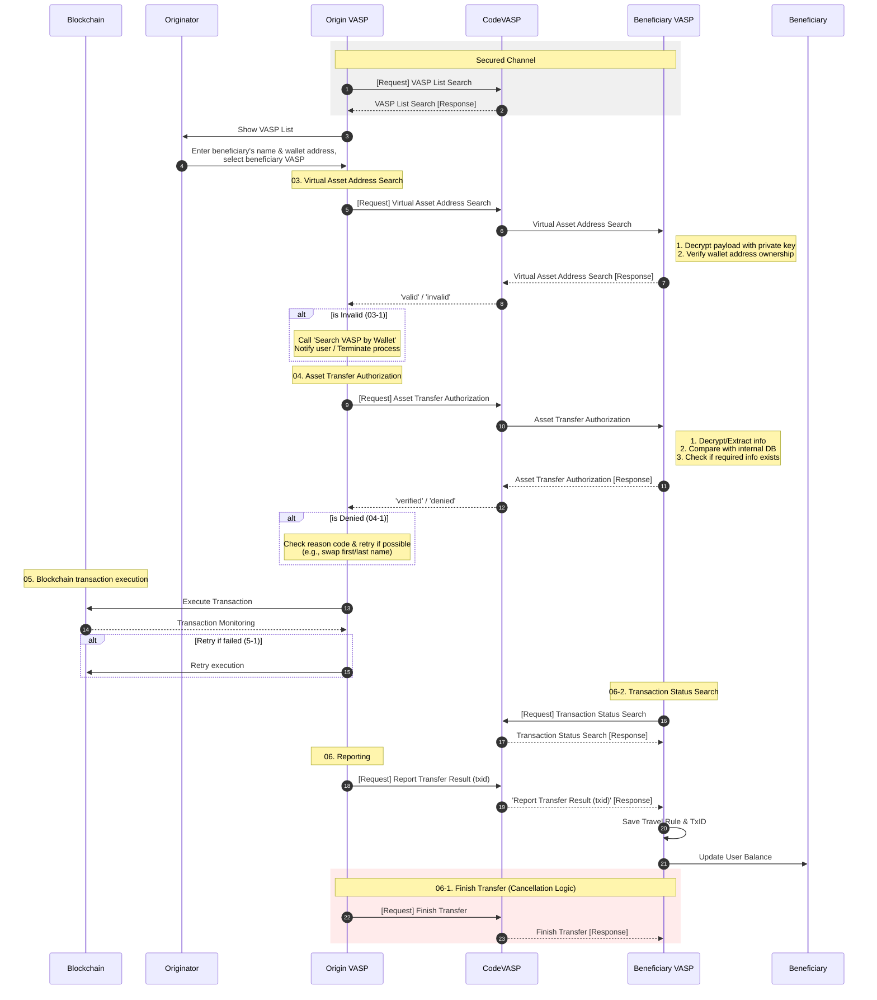
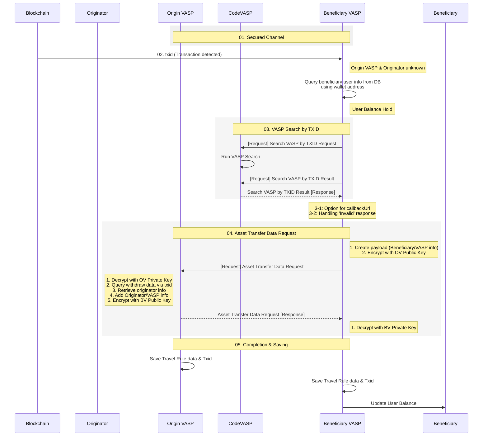

# Dev 00 - Communication Scenarios

Communication scenarios for the Travel Rule can be divided into two categories.
1. **Standard**: Transactions where both the originating and beneficiary VASPs comply with the Travel Rule.
2. **Sunrise**: Transactions where only one side (beneficiary) complies with the Travel Rule due to a regulatory mismatch.
# Standard

## 1. Encrypted Communication

Travel Rule traffic between the originating VASP - CodeVASP - beneficiary VASP is protected with end-to-end encryption. Since users' personal information is encrypted, CodeVASP cannot access or process this data. 

To encrypt and decrypt data, public key and private key are used. To encrypt and decrypt data, use public and private keys. For encryption, fetch the counterparty VASP’s public key via the ‘VASP List Search’ or ‘Public Key Search’ API endpoints. For decryption, use your private key. 

Always encrypt the ‘payload’.

## 2. Managing VASP List
Each VASP should maintain a list of VASPs it can communicate with.

You can request the ‘VASP List Search’ from CodeVASP to retrieve a list of VASPs compatible with the CodeVASP protocol. This list can be displayed as the "Exchange" list on the user withdrawal interface.

When integrating with multiple protocols beyond CodeVASP, the same exchange may appear multiple times in the list. To avoid duplication, filter the list using a unique identifier, such as ‘entityId’.

Additionally, whether a VASP supports actual deposits and withdrawals depends not only on protocol integration but also on policy-based integration. Policy-based integration performed after CodeVASP protocol setup and varies based on jurisdiction and the VASP’s internal policies. When managing the VASP list displayed to users, ensure you account for actual integration status to avoid confusing or misleading users.

Users will select a beneficiary VASP from this list and enter a wallet address.

## 3. Wallet Address Verification

Before the originating and beneficiary VASPs communicate for asset transfers, verify that the wallet address entered by the user belongs to the selected VASP.

During the asset transfer authorization request, personal information such as the user’s name and date of birth (DoB) is exchanged. To prevent data leaks to an unrelated third party from user errors in selecting the beneficiary VASP, validate the selected VASP first.

### 3-1. Invalid Wallet Address

If the response is ‘invalid’, the target VASP was incorrectly selected. You can implement a fallback process using ‘Search VASP by Wallet’ API. If ‘Search VASP by Wallet’ returns ‘valid’, update the target VASP information and proceed. If ‘invalid’, terminate the process and guide the user to restart from the beginning.

## 4. Asset Transfer Authorization

This stage involves the originating and beneficiary VASPs exchanging information to comply with the travel rule. The originating VASP populates the ‘payload’ with details about the originating VASP, originator, beneficiary VASP, and beneficiary. The originator’s information must include their date of birth (DoB), while the beneficiary’s information may exclude it. Encrypt the ‘payload’ and send it via the 'Asset Transfer Authorization' API. 

The beneficiary VASP decrypts the payload and compares the travel rule data with its database. Depending on internal policies, the beneficiary VASP may check for the presence of specific originator details(e.g., name, wallet address). Make sure the originator’s information follows the CodeVASP guidelines.

### 4-1. Authorization Denied

If the response is ‘denied’, check the ‘reasonType’ and ‘reasonMsg'. You may retry based on the reason. For example, for ‘INPUT_NAME_MISMATCHED’, you could retry by switching the first/last name sequence.  For reasons unsuitable for retry, terminate the process and proceed with steps tailored to each reason.

## 5. On-Chain Transaction

Once the asset transfer authorization is approved, the originating VASP executes the on-chain transaction. The beneficiary VASP monitors the transaction and detects its completion.

### 5-1. Transaction Failure

If the blockchain transaction fails, you can retry blockchain execution.

## 6. Asset Transfer Result Report

After the blockchain transaction completes, the originating VASP sends the txid to the beneficiary VASP to confirm the asset transfer’s success. The beneficiary VASP links the travel rule data with the txid using the ‘transferId’ and stores it. Some beneficiary VASPs may not process deposits without the txid, so it must be sent.

If the process completes successfully, both VASPs store the travel rule data and txid, and the beneficiary VASP updates the user’s balance.

### 6-1. Undelivered txid

If the beneficiary VASP does not receive the txid after a specified period, it can query the transaction status using the ‘Transaction Status Search’ API.

### 6-2. Transaction Failure After Txid Report

In rare cases, the blockchain transaction may fail after the txid is reported, or the user may cancel the transfer immediately after. In such cases, the originating VASP must notify the beneficiary VASP using ‘Finish Transfer’ API.

---
# Sunrise

## 1. Encrypted Communication

Travel Rule traffic between the originating VASP - CodeVASP - beneficiary VASP is protected with end-to-end encryption. Since users' personal information is encrypted, CodeVASP cannot access or process this data. 

To encrypt and decrypt data, public key and private key are used. To encrypt and decrypt data, use public and private keys. For encryption, fetch the counterparty VASP’s public key via the ‘VASP List Search’ or ‘Public Key Search’ API endpoints. For decryption, use your private key. 

Always encrypt the ‘payload’.

## 2. Anonymous Transactions

Anonymous transactions occur when assets are received without prior verification or authorization, often due to differing regulatory requirements across jurisdictions. For a beneficiary VASP, this means assets arrive at a user’s wallet without knowing the originating VASP or user.

When such transactions occur, the beneficiary VASP queries user information based on the wallet address and holds off on updating the user’s balance.

## 3. VASP Search

To comply with regulations and process an anonymous transaction, the beneficiary VASP must identify the originating VASP. Send a ‘Search VASP by TXID Request’ request to CodeVASP, which queries its network for matching transfer records.

This request is asynchronous, so call the ‘Search VASP by TXID Result’ API to retrieve the result. A ‘valid’ response indicates a successful search, allowing you to proceed with the identified VASP as the target.
### 3-1. Callback URL

If calling the result API feels inconvenient, include a ‘callbackUrl’ in the ‘Search VASP by TXID Request’ request. CodeVASP will send the result to this URL upon completion. Ensure the URL allows CodeVASP’s IP access.

### 3-2. Invalid Result

If the result is invalid, follow internal policies, such as requesting clarification from the customer.

## 4. Data Request

Once the originating VASP is identified, the beneficiary VASP initiates user data exchange. Populate a ‘payload’ with ‘Beneficiary’ and ‘BeneficiaryVASP’ information, encrypt it, and send the request.

The originating VASP decrypts the ‘payload’, retrieves transfer and user information based on the txid, adds ‘Originator’ and ‘OriginatingVASP’ details, encrypts the payload, and responds.

The beneficiary VASP decrypts the received 'payload'.

## 5. Data Storage

Both the originating and beneficiary VASPs store the asset transfer and travel rule data. The beneficiary VASP updates the user’s balance. This process, where the stricter-regulated VASP queries the less-regulated one, ensures travel rule compliance.