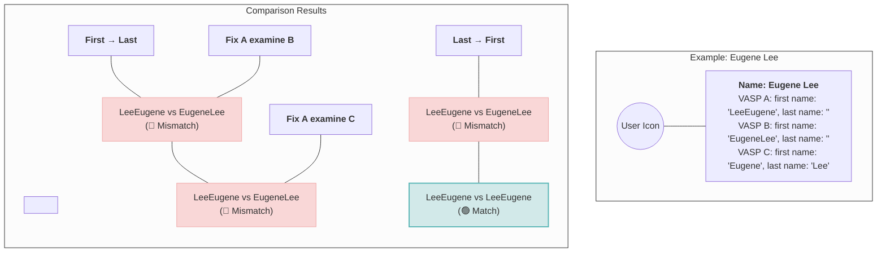
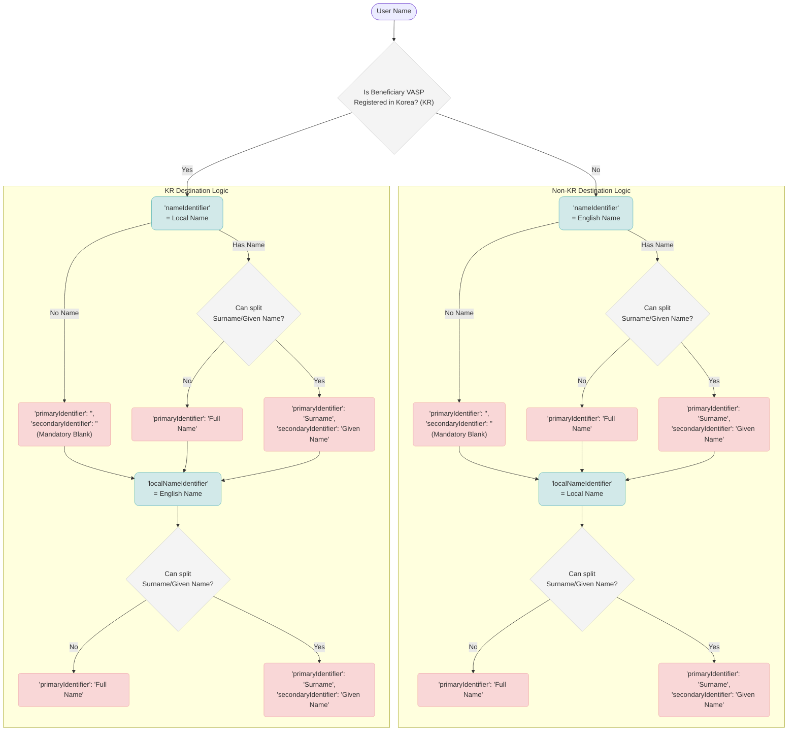
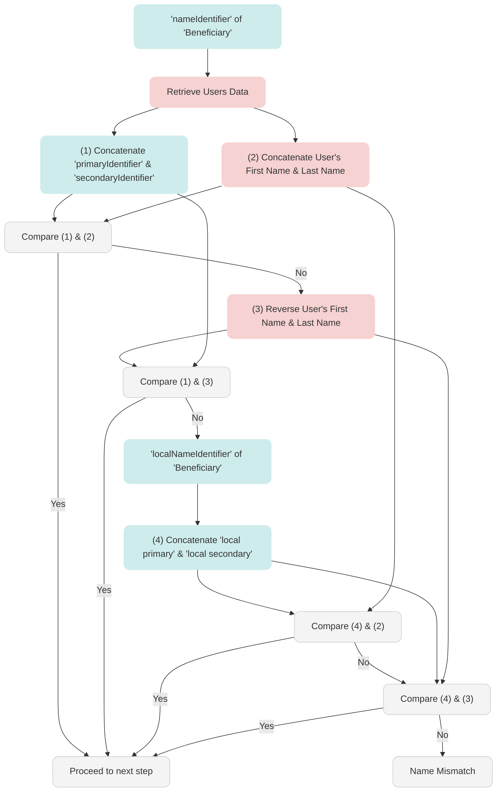

# Dev 06 - Verify Names

## General Rules

* General rule for name is to separate the surname and given name when entering the name of a natural person.
* Use PascalCase for the following objects: `Originator`, `Beneficiary`, `OriginatorVASP`, and `BeneficiaryVASP`. All other fields should follow camelCase.
* The field `primaryIdentifier` must always be present with a value, whereas `secondaryIdentifier` must always be present but may be left empty.
* Unless otherwise specified, all field values are case-insensitive.
* When validating names, whitespace should be removed before comparison.
* All field values must be expressed as UTF-8 encoded strings, including booleans, integers, and floats.
* Unless Korean is explicitly allowed, all values must be entered in English.
* If there is no official English name, the Korean name must be transliterated according to the official [Korean Romanization](https://www.korean.go.kr/front_eng/roman/roman_01.do).

## 1. Separating the First Name & Last Name

Since the components and order of names vary by country, VASPs (Virtual Asset Service Providers) often have different verification policies. Therefore, separating the surname and given name allows for flexibility in combining them in different orders, which can improve verification accuracy. If the surname and given name are treated as a single field, it becomes difficult to verify the name in cases where the order differs, as in the example above.

Therefore, if you are using an external KYC solution, it is recommended to verify how the user's name data is being handled, ensure that the surname and given name are separated, and, if applicable, also store the user's Local name.
## 2. Name Normalization
1. Split surname and given name 
2. Convert all alphabetic characters to lowercase
3. Remove special characters, numbers, and whitespace
4. Reverse the order of surname and given name

> [!NOTE]
> **Example** — Name: `Jean-Luc O'Connor`
> 
> | Step | Surname | Given Name |
> |------|---------|------------|
> | Original | `O'Connor` | `Jean-Luc` |
> | Lowercase | `o'connor` | `jean-luc` |
> | Remove special chars | `oconnor` | `jeanluc` |
> | Combined (both orders) | `jeanluc` + `oconnor` → **`jeanlucoconnor`** & **`oconnorjeanluc`** | |

Name verification may fail when communicating with certain Korean exchanges if names contain special characters, numbers, or spaces. To avoid any potential issues, it is recommended to remove all special characters, numbers, and spaces from names before processing.

## 3. Name Notation as an Originating VASP
### 3-1. Natural Person 


#### 3-1-1. Language Rule
* Enter 'nameIdentifier' in English.
* If the beneficiary's name is in Korean(other than English) enter the name in the 'localNameIdentifier' element. However, even in this case, it is recommended to provide a 'nameIdentifier' with a legal English name.
* If there is no English name, enter `""` for `nameIdentifier` as shown below.
```json
{
  "name": {
    "nameIdentifier": [
      {
        "primaryIdentifier": "",
        "secondaryIdentifier": "",
        "nameIdentifierType": "LEGL"
      }
    ],
    "localNameIdentifier": [
      {
        "primaryIdentifier": "로버트 반스",
        "secondaryIdentifier": "",
        "nameIdentifierType": "LEGL"
      }
    ]
  }
}
```

#### 3-1-2. When Names can be Separated
* Enter the last name in 'primaryIdentifier'.
* Enter the first name in 'secondaryIdentifier'.

#### 3-1-3. When Names can NOT be Separated
* Enter the full name in 'primaryIdentifier' based on VASP DB. For English, enter the name in the order of first name and last name. For Korean, enter the name in the order of last name and first name. If you cannot identify first name and last name, then enter the same value as the value in the DB.
* Do not enter anything in 'secondaryIdentifier'.

### 3-2. Legal Person
For legal entities, it is necessary to provide both the entity's name and the name of its representative(The CEO). This requirement applies to both the sending and receiving of virtual assets.

The IVMS101 standard does not include a dedicated element for the representative's information within the 'legalPerson'. Therefore, the representative's information should be recorded as follows:

* The 'originatorPersons' or 'beneficiaryPersons' fields are arrays of the Person type. The first element of the array must always contain the information of the legal person.
* From the second element onwards, enter the personal information of the representative ('naturalPerson').
* Even if there are multiple representatives, all the information of representatives should be entered.

## 4. Verifying Names as a Beneficiary VASP
### 4-1. Comparing Natural Person Names

