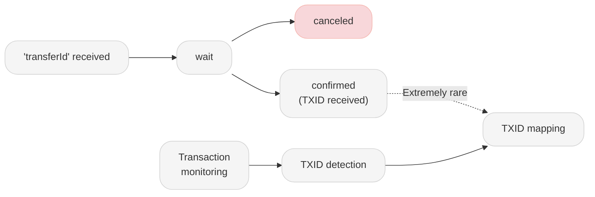

# Dev 09 - Asset Transfer Status Management

## 1. Data to Save
| Data                                   | Description                                             |
| :------------------------------------- | :------------------------------------------------------ |
| transferId                             | Unique ID assigned to asset transfer details            |
| status                                 | Status information of the asset transfer details        |
| Transaction asset information          | Asset transfer details, such as symbol, amount, etc.    |
| Sender/receiver information            | The name of the party to the asset transfer transaction |
| Sending/transmitting VASPs information | Information on asset transfer VASP                      |

## 2. Status
The status values of the transferId must be managed in a more detailed way. This is not only to manage each transfer case properly, but also to **provide accurate responses when the counterparty (beneficiary) VASP requests a [Transaction Status Search](https://code-docs-en.readme.io/reference/request-transaction-status-search) inquiry.**

The content of this page is for guidance only, but it outlines the minimum required standards. We would appreciate it if you could refer to it and follow accordingly.
| Status         | Description                                                                                                                      |
| :------------- | :------------------------------------------------------------------------------------------------------------------------------- |
| wait           | The originating VASP has requested the beneficiary VASP for the asset transfer authorization and is waiting for its response.    |
| verified       | The asset transfer has been authorized by the beneficiary VASP, but the transaction has not yet been executed on the blockchain. |
| denied         | The asset transfer authorization has been denied by the beneficiary VASP.                                                        |
| pending        | The blockchain transaction has not been sent yet and is currently pending.                                                       |
| processing     | The transaction has been sent to the blockchain but is currently waiting to be mined.                                            |
| wait-confirmed | The blockchain transaction has been mined, but finality has not yet been secured.                                                |
| confirmed      | The asset transfer on the blockchain has been completed, and the TXID has been updated.                                          |
| canceled       | The asset transfer has been canceled, and the transaction was not executed on the blockchain.                                    |

## 3. Beneficiary VASP View

> [!NOTE]Is it possible for a 'confirmed' status to change to 'canceled'?
> We recommend that VASPs change the status to 'confirmed' (‘Report Transfer Result’) only after finality has been secured.
> However, each VASP has its own criteria for determining finality. For example, Exchange A may consider finality sufficient after three additional blocks are generated, whereas Exchange B may require six blocks for confirmation. Therefore, there is a probabilistic chance that the status may change from 'confirmed' to 'canceled'.

* verified / denied: Determined based on the response from the counterparty VASP to the 'Asset Transfer Authorization' request..
* Sending the 'Asset Transfer Result'(txid) is recommended only after blockchain finality has been secured.
* There is a probabilistic chance that a 'confirmed' transferId may also be canceled.
