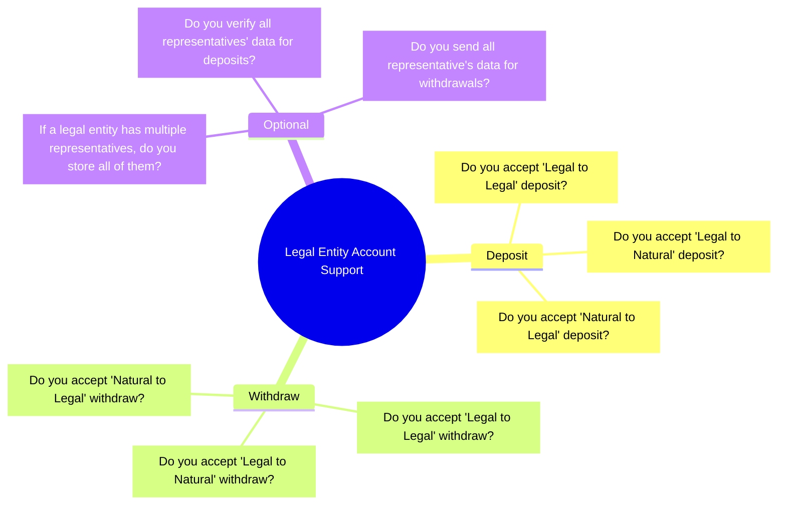
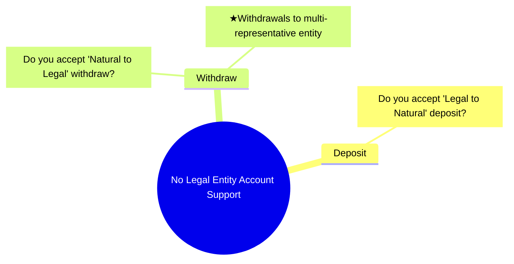

# Corporate Travel Rule Policy

## 1. Intro
### 1-1. Core Concept
* When a legal entity is the sender or receiver of digital assets, **the Travel Rule process remains the same.**
* Just like when a natural person initiates a transfer, a legal entity follows the same sequence— wallet verification → asset transfer authorization → report result — and calls the APIs accordingly.

## 2. Policy Alignment
### 2-1. With Corporate Support

The policies to be configured when supporting corporate members are as follows.

In particular, regarding multi-representative entities, CodeVASP’s guideline states: 'When processing a withdrawals, include information for all representatives, and when processing deposits, verify all of them.' However, since policies for multi-representative verification are still being established, a flexible approach may be needed in the initial phase. For detailed guidance, please contact the CodeVASP team.

### 2-2. Without Corporate Support

Even if corporate members are not supported, it is still necessary to establish a policy on whether deposits and withdrawals will be allowed when the counterparty is a legal entity.

In particular, when processing a withdrawal to a multi-representative entity, please note that the counterparty VASP may require Travel Rule information for all representatives, depending on its verification policy.
### 2-3. Common Considerations
- If corporate deposits and withdrawals are allowed, the format of the 'originator' and 'beneficiary' objects may differ. The development team should be aware of this in advance.
- Also, consider whether the UI needs to be updated to allow entry of multiple representatives when handling legal entity withdrawals. Depending on the type of legal entity, there may be more representatives than expected.

## 3. Check Counterparty Policy
For the implementation of legal-to-legal Travel Rule transactions, it is important not only to design our internal policy properly but also to check the counterparty VASP’s policy.

To ensure consistent guidance, CodeVASP is currently collecting and consolidating each VASP’s internal policies. If you have established its corporate Travel Rule policy, please share it with us. If you need information about another VASP’s policy, please contact the CodeVASP team!