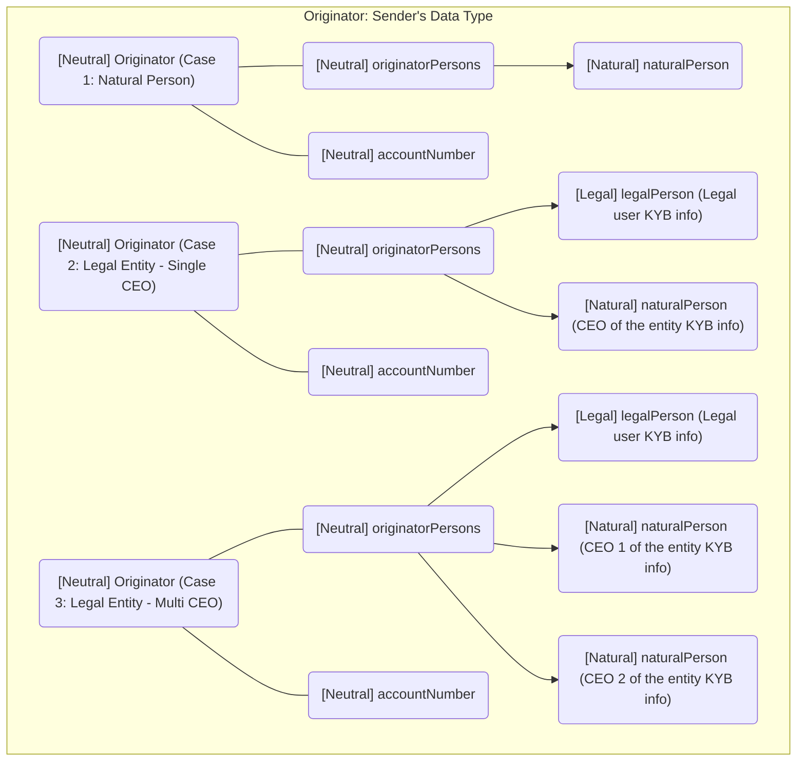
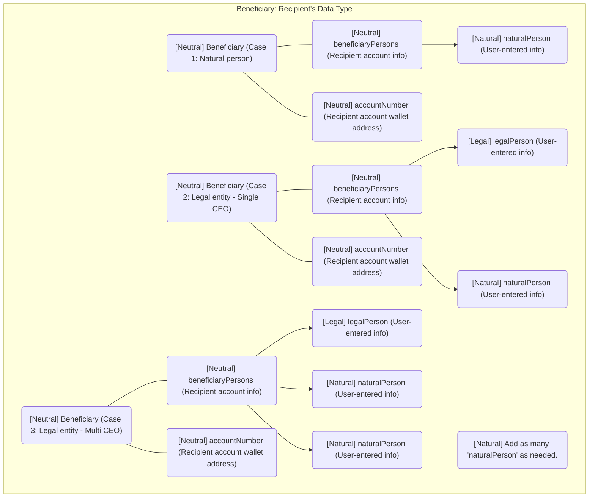
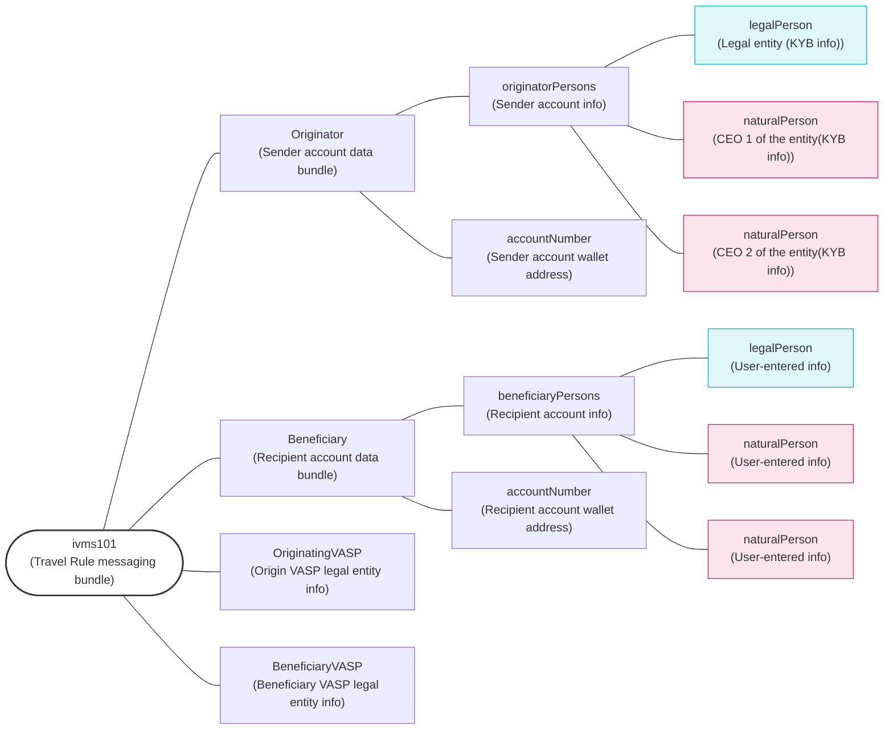
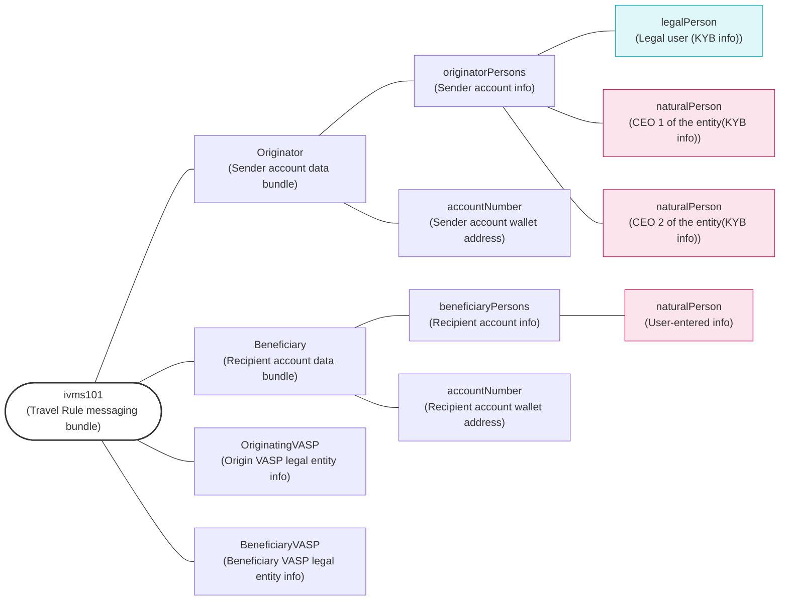
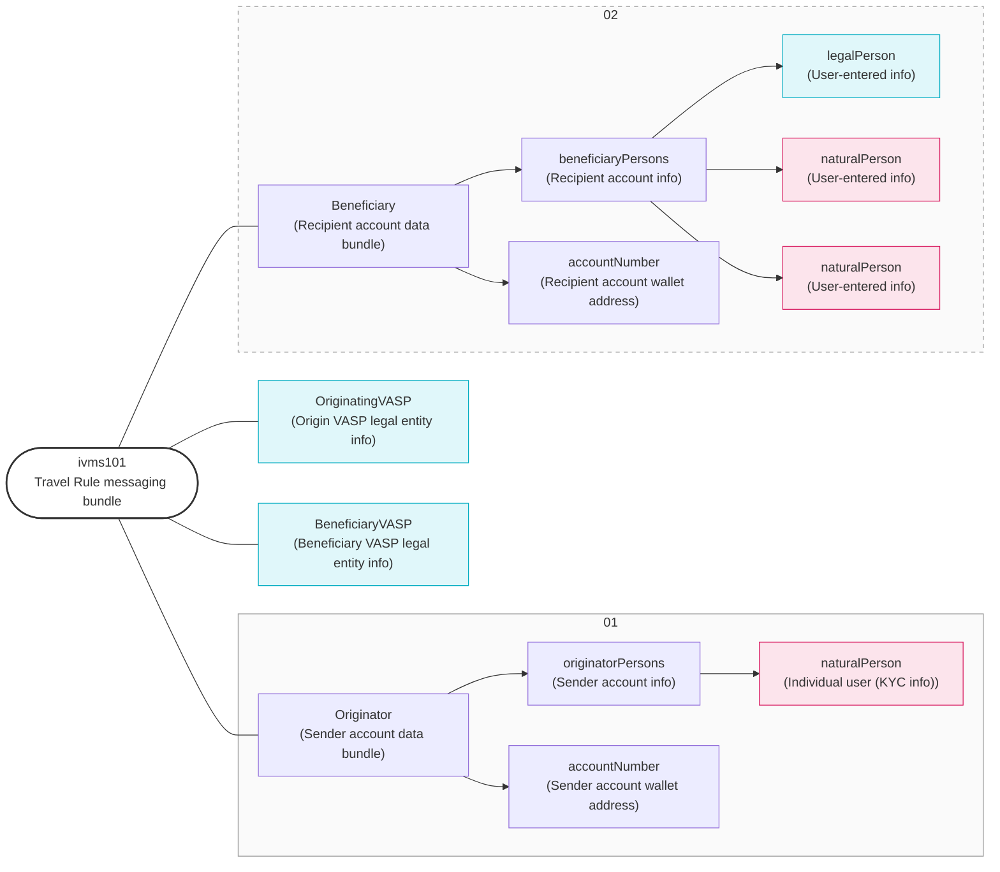
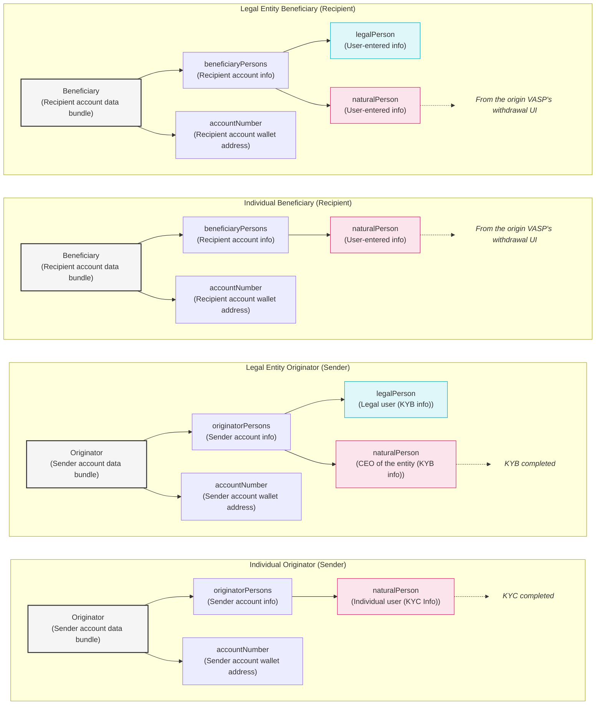
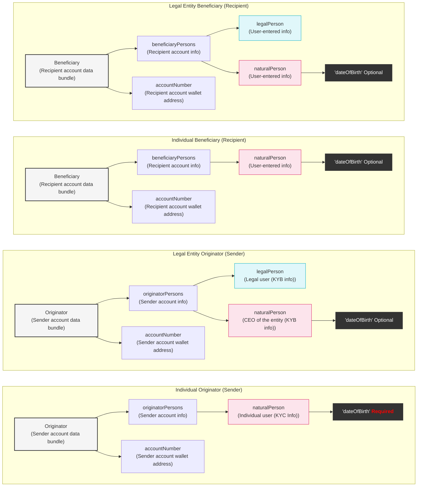

# Corporate Travel Rule Comprehensive Guide

## Originator: Sender's Data Type

##  Beneficiary: Recipient's Data Type

## ‘Legal to Legal’ Deposit/Withdraw Guide

### To do when withdraw
1. Acquire needed information
	1. The originator information is populated using the data stored in our database, which was obtained during the KYB process.
	2. The ‘dateOfBirth’ field under the ‘naturalPerson’ of the originator entity is not required. The recipient information is obtained from the customer.
	3. The ‘dateOfBirth’ field under the recipient entity’s ‘naturalPerson’ is not required.
	4. Required data may differ by the counterparty VASP’s policy. Check their policy before sending legal entity Travel Rule information.
2. Check for counterparty VASP’s policy
	1. Transfers involving legal entity may differ by country regulations and each VASP’s internal policy.
		1. e.g) Korean regulation: Beneficiary  CEO(‘naturalPerson’) info under ‘legalPerson’ of Beneficiary is also required  
		2.  e.g) VASP policy: Some VASPs allow transfers between 1st-party only. 
		3.  e.g) VASP policy: Some VASPs may require all information of CEO for multi-CEO entity
### To do when deposit
1. Save sender account data
	1. Please store it to comply with the Travel Rule.
	2. Make sure it is properly mapped to data such as TxID or Transfer ID.
2. Legal entity check
	1. Verify if ‘legalPerson’ exists in the originator or beneficiary data.
3. Query user data
	1. Based on the accountNumber (recipient wallet address), retrieve from our legal entity customer database.  
	2. The data obtained through KYB during the customer’s onboarding process must be stored in advance.
4. Check internal policy
	1. Verify whether our policy allows deposits for the ‘legal to legal ‘ type.  
	2. Review which data fields must match (entity info, representative info, or both).  
	3. If multiple representatives exist, check whether all or at least one must match.
5. Verify beneficiary data and our user data
	1. Representative information of a legal entity is often obtained during the KYB process rather than through a separate KYC procedure.  
	2. Text mismatches may occur due to naming format differences
## ‘Legal to Natural’ Deposit/Withdraw Guide

### To do when withdraw
 1. Acquire needed information
	 1. The originator information is populated using the data stored in our database, which was obtained during the KYB process.
	 2. The ‘dateOfBirth’ field under the ‘naturalPerson’ of the originator entity is not required.
     The recipient information is obtained from the customer.
	 3. The ‘dateOfBirth’ field under the recipient entity’s ‘naturalPerson’ is not required.
2. Check for counterparty VASP’s policy
	1. Check if the counterparty accepts deposits from legal entities or only allows first-party transfers.
### To do when deposit
1. Save sender account data
	1. Please store it to comply with the Travel Rule.   
	2. Make sure it is properly mapped to data such as TxID or Transfer ID.
2. Legal entity check
	1. Verify if ‘legalPerson’ exists in the originator or beneficiary data.
3. Query user data
	1. Based on the accountNumber (recipient wallet address), retrieve from our legal entity customer database.
4. Check internal policy
	1. Verify whether our policy allows deposits for the ‘legal to natural ‘ type.
5. Verify beneficiary data and our user data
	1. Verify if the Travel Rule recipient data matches our customer’s KYC data.
	2. Adding a name-order switching logic (first ↔ last) can increase match accuracy.
## ‘Natural to Legal' Deposit/Withdraw Guide

### To do when withdraw
1. Acquire needed information
	1. The originator information is populated using the data stored in our database, which was obtained during the KYB process.
	2. The ‘dateOfBirth’ field under the ‘naturalPerson’ of the originator entity is not required. The recipient information is obtained from the customer.
	3. The ‘dateOfBirth’ field under the recipient entity’s ‘naturalPerson’ is not required.
	4. Required data may differ by the counterparty VASP’s policy. Check their policy before sending legal entity Travel Rule information.
2. Check for counterparty VASP’s policy
	1. Transfers involving legal entity may differ by country regulations and each VASP’s internal policy.
		1. e.g) Korean regulation: Beneficiary  CEO(‘naturalPerson’) info under ‘legalPerson’ of Beneficiary is also required  
		2. e.g)VASP policy: Some VASPs allow transfers between 1st-party only. 
		3. e.g)VASP policy: Some VASPs may require all information of CEO for multi-CEO entity
## Tips
### ‘naturalPerson’ Data Source

#### When the Originator is a 'naturlaPerson'
- The 'naturlaPerson' information comes from the KYC database
#### When the Originator is a 'legalPerson'
- The 'naturlaPerson' information comes from the KYB database
- When processing and saving the data: 
	- Collect both local and English names.
	- Store first name and last name separately.
	- Design a refined fallback process for name verification.
#### When the Beneficiary is a 'naturlaPerson'
- The 'naturlaPerson' information comes from the origin VASP’s withdrawal UI
- It was entered by the user. 
#### When the Beneficiary is a 'legalPerson'
- The 'naturlaPerson' information comes from the origin VASP’s withdrawal UI
- May require multiple name input fields
### ‘naturalPerson’ Date of Birth

