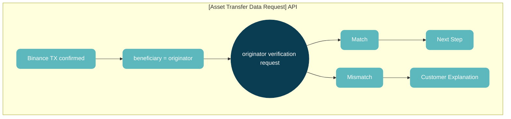

# Communicating With Other Protocols

## 1. To GTR(specific to Binance)
* The process differs when communicating with Binance, which is integrated with the GTR solution. 
* Unlike Travel Rule processing for natural persons, ID-Connect is not supported for legal entities.

### 1-1. As an originator
* The communication process remains the same, but additional required fields are introduced:
    1. ‘address’ 
    2. ‘tag’
    3. ‘network’

### 1-2. As an beneficiary
* As of now, Binance does not proactively send Travel Rule data.
* If it is confirmed—e.g., via ‘Search VASP by TXID’—that the transaction originated from Binance, please verify the originator and beneficiary information using a ‘Asset Transfer Data Request’.
* Note that the originator information must be provided when making the verification request.
* The originator information can be obtained in the following two ways.
    * Enter the same KYB information as the receiving wallet. 
      (Originator’s wallet address is optional) ※Note: This will only allow self-transfers.
    * Request an explanation from the customer
* If the information does not match, Binance will return an ‘error’ response.
* For a smoother workflow, we recommend verifying against the beneficiary information first and initiating an explanation request to the customer.

