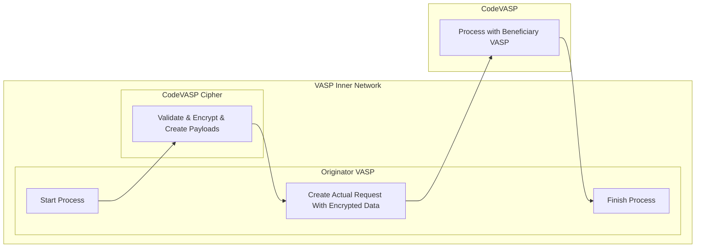

# 02-1. CodeVASP-Cipher Server Module Guide

CodeVASP-Cipher is an encryption/decryption/signature module. It is provided to make it more convenient to integrate CodeVASP travel rule. With Cipher, you don't need to generate signatures by yourself, which makes development more convenient.



CodeVASP-Cipher Server is a module that can be used without coding encryption/decryption yourself, and can be deployed on your infrastructure. This module is designed to simplify the integration of CodeVASP travel rule. This module does not send data to the CodeVASP server or store data; it only performs data processing tasks for the CodeVASP protocol (signature generation, data encryption, auto-create IVSM101 format, etc.). This module can run on your internal network and can be isolated as desired to fit your infrastructure configuration.

# System Requirements

> * OS: Linux 64bit (x86 or Arm)
> * CPU: 1vCPU, 2vCPU recommended
> * Memory: Minimum 2G, 4G recommended
> * Storage: Minimum 8G, 16G recommended

# How to run CodeVASP-Cipher server

## 1. Create password file for CodeVASP-Cipher module

```text
vim code_cipher_password
```

## 2. Put the password in the file (plain text file you just created)

The password should have been given to you from CodeVASP. This is the same password that you should use for the Dashboard([https://alliances.codevasp.com/en/login](https://alliances.codevasp.com/en/login))

## 3. Create Docker environment file

You can use any file name for this(you will be using this file in step 5 below). e.g. local_env

```text
;Code-Cipher
PORT=enter port for the Cipher should be using

;Keys
CODE_ALLIANCE_PRIVATE_KEY=Private key you created to integrate CodeVASP
```

## 4. Login to CodeVASP Travel rule repository with Docker

Your id is the same id that you are given to login the Dashboard.

```text
docker login -u <<your id>> --password-stdin aej6xvrqt6.execute-api.ap-northeast-2.amazonaws.com < <<your password location>>

e.g.)
docker login -u code-cipher --password-stdin aej6xvrqt6.execute-api.ap-northeast-2.amazonaws.com < ./code_cipher_password
```

## 5. Run the Docker server

```
docker run -d -p <<port>>:<<port>> --env-file=<<your env file location>> --name=code-cipher aej6xvrqt6.execute-api.ap-northeast-2.amazonaws.com/code-cipher:latest

e.g.)
docker run -d -p 8787:8787 --env-file=./local_env --name=code-cipher aej6xvrqt6.execute-api.ap-northeast-2.amazonaws.com/code-cipher:latest
```

## 6. Logout when needed

```
docker logout aej6xvrqt6.execute-api.ap-northeast-2.amazonaws.com
```

# Swagger

You may open swagger API definition documentation with `your-host:port/swagger-ui/index.html`.

# Prometheus

You can monitor Cipher docker with prometheus data `your-host:port/actuator/prometheus`.

# Build Version

You can check the build version of the image here `your-host:port/actuator/info`.

```json Example Result
{  
  "build": {  
    "group": "com.codevasp",  
    "project": "CodeVASP Travel Rule CodeVASP-Cipher",  
    "supportEmail": "support@codevasp.com",  
    "dockerBuildTime": "2025-02-12T04:58:21Z",  
    "version": "c356ad8"  
  }  
}
```

* `dockerBuildTime` : Current image build date and time. (UTC)
* `version` : This is the tag of the image. You can run the docker image with this tag. e.g. `code-cipher:tag`
