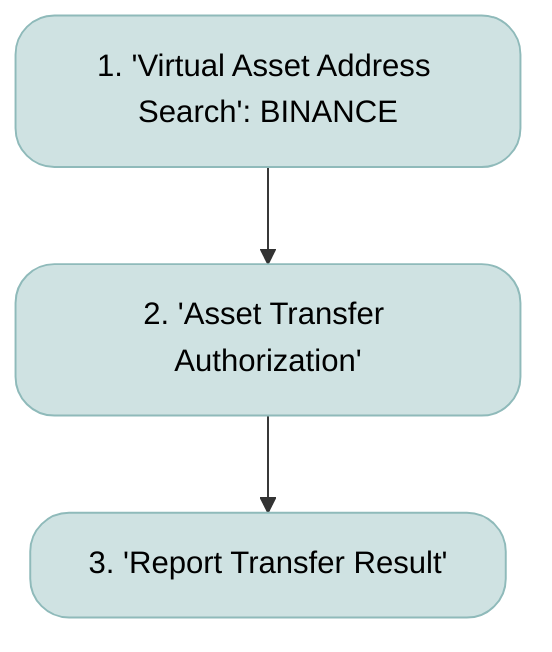
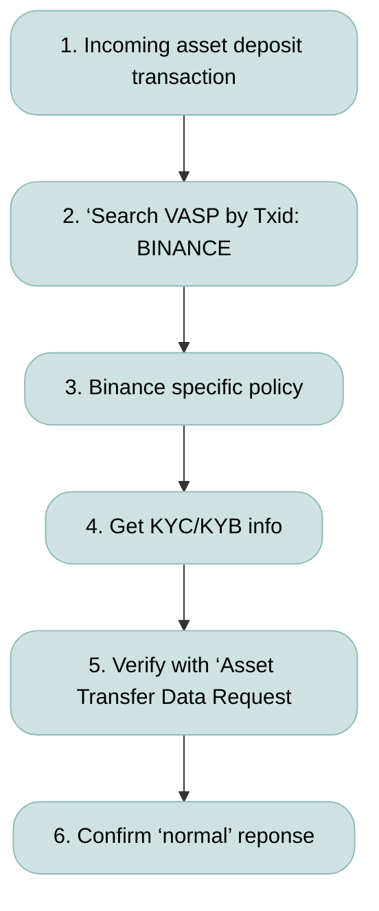

# 04-Communicating-With-Other-Protocols

## **Prerequisites**
### **Policy**
* Internal policies and processes must be designed separately, taking into account the unique nature of **Binance's Travel Rule operations** (detailed below).
* Most importantly, a policy is required to determine whether to allow **only first-party transfers** (self-transfers) or to permit **third-party transfers** as well.

### **Binance Specifics**
* Currently, Binance does not proactively send Travel Rule data.
* For inbound transfers, they do not follow a "requesting originator/beneficiary personal info" model. Instead, they use a **verification model** to confirm if "the provided originator/beneficiary information is correct." This means we must first acquire the counterparty's information and then request Binance to verify its accuracy.
* Generally, only first-party transfers are allowed for automated processing. However, if a policy is established to allow third-party transfers—reflecting the specific nature of **legal entity accounts**—a process must be added to collect counterparty information from the user.
* **ID-Connect** cannot be used for legal entity Travel Rule processes because it does not support the input of corporate (legal entity) information, unlike individual Travel Rule processes.
* When processing inbound transfers, the workflow can initially branch into either **ID-Connect** or the **"Search VASP by TxID"** process, depending on the recipient account type (Individual/Legal Entity).

### **Development**
* Please check the **Entity ID** and **Public Key** of the Binance Global exchange through the **'Query VASP List'** API.
* Requests where the Binance Global Entity ID is the `origin` must be permitted.
* The **'Virtual Asset Address Search'** and **'Asset Transfer Authrization'** APIs require the following additional parameters: `address`, `tag`, and `network`.
* For `network` information, please refer to the **[Network by Coins]** page.

# Withdraw to Binance

1. **Receive the asset destination address from the user, request a query to Binance, and confirm the 'valid' response.**
  - Use the **'Virtual Asset Address Search'** API.
  - The `address`, `tag`, and `network` information must be provided as mandatory fields in the request.
  - For `network` details, please refer to the **[Network by Coins]** page.

2. **Call the 'Asset Transfer Authorization' API and confirm the 'verified' response.**
  - Use the **'Asset Transfer Authorization'** API.
  - The `address`, `tag`, and `network` information must be provided as mandatory fields in the request.
  - For `network` details, please refer to the **[Network by Coins]** page.
  - For instructions on object creation, please refer to the **[Create Travel Rule Object]** page.

3. **After completion, send the TxID using the 'Report Transfer Result' API.**
  - Use the **'Report Transfer Result'** API.
 

# Deposit from Binance 

1. **Assets are deposited without Travel Rule information. Depending on the recipient account type (Individual/Legal Entity), proceed with 'ID-Connect' for individuals or 'Search VASP by TxID' for legal entities.**
2. **Confirm that the originating VASP of the transaction is Binance through the 'Search VASP by TxID' process.**
  - Use the **'Search VASP by TxID'** API.
  - The `network` information must be provided as a mandatory field in the request.
  - For `network` details, please refer to the **[Network by Coins]** page.
3. **Determine the policy considering the unique communication method with Binance.**
  - Since Binance uses a **verification model** ("Is this originator info correct?") rather than a "Send us the originator info" model, typically only **first-party transfers** are supported for automation.
  - Decide whether to support **third-party (other-to-self) transfers**, taking into account the specific nature of **'legal-to-legal'** asset transfers.
  - If third-party transfers are supported, a process must be added to request the originator's information (Individual/Legal Entity) from the user who received the Binance withdrawal transaction.
4. **Input the originator and beneficiary information to generate Travel Rule data.**
  - **First-party transfer:** Input the recipient account's KYB information into both the `originator` and `beneficiary` fields.
  - **Third-party transfer:** Input the recipient account's KYB information into the `beneficiary` field, and input the sender's information (received from the user) into the `originator` field. (Identification of individual or legal entity is required.)
5. **Verify whether the originator information we sent matches Binance's data via the 'Asset Transfer Data Request' API.**
6. **Confirm the 'normal' response and finalize the deposit processing.**
 