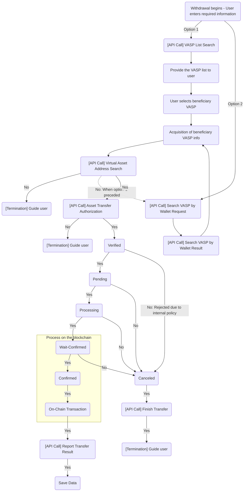
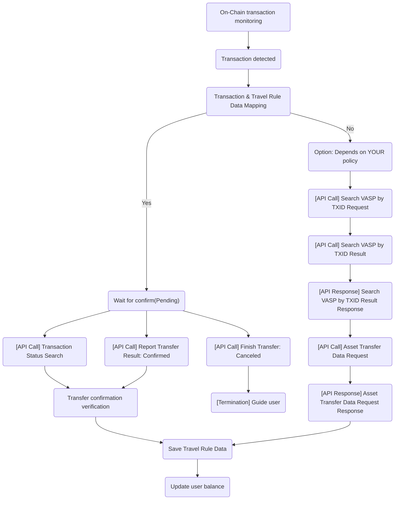

# 02_Transaction_Flow

> **Note:** The flows below represent a simplified version of a VASP's deposit and withdrawal processes with Travel Rule requirements applied. The actual implementation and sequential steps may vary depending on each individual VASP's internal policies and system architecture.

### 2. Deposit 

