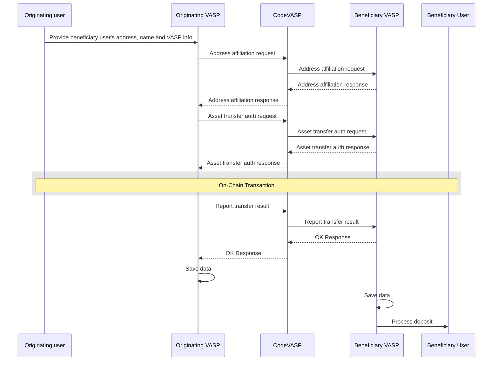
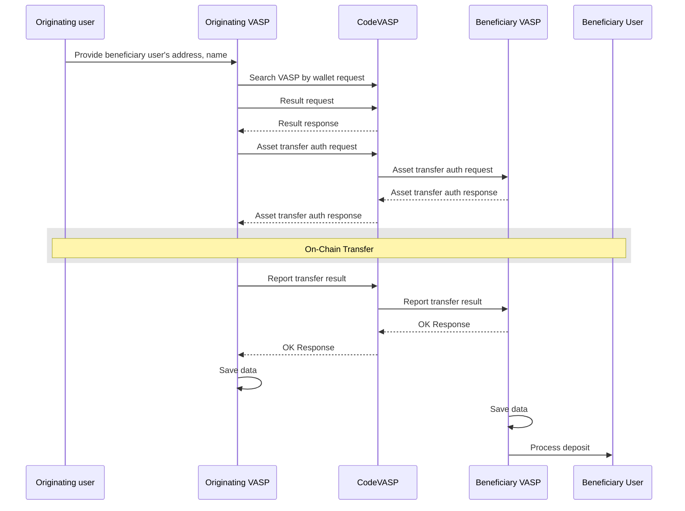
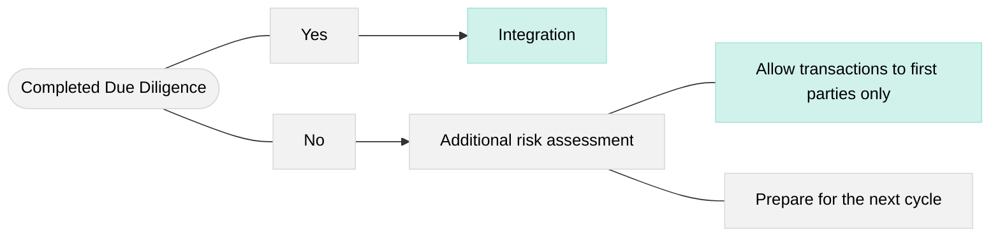

# 03_General FAQ

## 1. What are the critical prerequisites before starting technical integration and development?

It is **crucial** to establish clear internal policies before entering the development stage. All technical development and system design must adhere to the VASP's (Virtual Asset Service Provider) internal policies and compliance rules. 

Therefore, Compliance Managers, Project Managers, and Product Managers must share a comprehensive understanding of:
- The FATF (Financial Action Task Force) guidelines.
- The specific jurisdiction's laws, guidelines, and regulatory frameworks (e.g., the strict rules enforced by the Korea Financial Intelligence Unit (KoFIU) in South Korea, or the Markets in Crypto-Assets (MiCA) regulation in the EU).
- The IVMS101 data standards.
- The VASP's specific internal compliance and risk policies.

### Practical Examples of Policy Implementation in Workflows:

#### A. Inbound Transfers (Asset Deposits)
When a user deposits assets into their wallet, the receiving VASP must have processes in place to:
- Execute **KYT (Know Your Transaction)** or on-chain analysis to assess and mitigate risks associated with the incoming funds.
- Verify the availability, completeness, and accuracy of the accompanying Travel Rule data.

#### B. Outbound Transfers (Asset Withdrawals)
When a user requests to withdraw assets to an external wallet (e.g., another VASP), the originating VASP must:
- Check that the destination address is not flagged by blockchain intelligence or compliance tools.
- Ensure that the correct and required Travel Rule data has been securely transmitted and verified by the Beneficiary VASP *prior* to authorizing the on-chain transfer.

## 2. Does CodeVASP save personal information and transaction data of users?

CodeVASP is unable to monitor or save the personal and transaction data of users. VASPs transfer data in an encrypted format. CodeVASP facilitates the data transmission process and cannot decrypt or access the data.

## 3. How long does it take to integrate?

It differs depending on the member's situation and process. The fastest case on record is 3 days.

## 4. Is it possible to deposit and withdraw with all CodeVASP members right after the integration?

Depending on the counterpart VASP's policy, additional DD (Due Diligence) may be required. Since CodeVASP conducts its own initial DD review, it is possible to reduce the lead time.

## 5. What is the communication channel?

CodeVASP supports members through Slack, Email, or Lark. After signing the contract, a separate Slack channel can be opened and members will be invited.

## 6. Why is verifying the Beneficiary VASP important, and how is it done?

Verifying the accurate beneficiary VASP information is crucial, yet challenging, for authenticating the Travel Rule.

1. **Compliance Failure:** If the beneficiary VASP information is missing, the transaction cannot be considered compliant with the Travel Rule.
2. **Information Leakage:** Attempting to transfer assets to an incorrect counterpart VASP creates a risk of leaking sensitive user information.
3. **Data Omission:** Inaccurate beneficiary VASP information can lead to the omission of Travel Rule data transmission entirely, even though it is mandatory for the transfer.
4. **Operational Overhead:** Failure to authenticate the receiving VASP correctly will likely lead to an increase in customer support inquiries and operational friction.

To obtain beneficiary VASP information—one of the most critical parts of the Travel Rule—there are two primary options: **ask the user directly** or **query CodeVASP**. The chosen method will alter the process flow. The sequence diagram below illustrates the process when the beneficiary VASP information is obtained directly from the user.



Alternatively, if the VASP chooses to **query CodeVASP** to automatically discover the Beneficiary VASP based on the wallet address, the flow changes to utilize the `Search VASP by wallet` API request:



### Handling Address Not Found (`NOT_FOUND_ADDRESS`)

During the **Virtual Asset Address Search** phase (where the counterpart VASP and wallet address are confirmed), you may encounter an `invalid` response with a `reasonType` of `NOT_FOUND_ADDRESS`. This indicates that the queried wallet does not belong to the targeted exchange. 

Typically, at this point, the asset transfer process would be terminated. However, by utilizing CodeVASP's `Search VASP by Wallet` API request, you can employ two strategies to seamlessly connect the user experience:

1. **Option 1 (Inform and Restart):** Based on CodeVASP's response, inform the user which exchange the wallet address actually belongs to. Then, terminate the current transfer process and prompt the user to start over with the correct VASP selected.
2. **Option 2 (Override and Continue):** Continue the asset transfer process by overriding the user-provided VASP information with what CodeVASP supplied. Before automatically proceeding with the 'Asset Transfer Authorization', it is highly recommended to add a UI step where the new VASP information provided by CodeVASP is presented to the user for their final confirmation.

### When the User is Unsure About the Receiving Exchange

During virtual asset withdrawals, it is common for users to select the incorrect receiving exchange. This usually happens because the provided list of compliant exchanges is too lengthy, or the user simply does not know the exact legal name of the destination exchange.

To handle this gracefully and reduce errors, it is recommended to provide an **"Other"** option to simplify the dropdown list, or include an **"I'm not sure"** choice. 

If the user selects one of these options, you can invoke CodeVASP's `Search VASP by Wallet Request` API in the background. Because this API call operates asynchronously, positioning this option early in the withdrawal process (e.g., as soon as the user enters the destination wallet address) can significantly smooth out the user experience without causing unnecessary delays.

> **Note on Wallet Searches:** 
> The `Search VASP by Wallet Request` targets **only** user wallets capable of receiving deposits that are associated with member VASPs. It **does not** include the internal hot wallets of VASPs.

## 7. Recipient Policy: Minimize risk, maximize opportunity

VASPs set their deposit and withdrawal policies according to global regulatory trends and internal risk assessment criteria. In doing so, they often decide whether to integrate with a specific VASP in a binary manner (all or nothing). However, a more flexible approach can be considered.

One way to reduce risks from a compliance perspective while still seeking scalability from a business perspective is to **allow transactions only to and from the user's own wallet (First-party transfers)**.

Let's compare two policy options based on transaction restrictions:

### 1. Transactions to Third Parties
CodeVASP's Travel Rule requires verifying transaction information for both personal and third-party transactions. VASPs providing an environment where users can freely transfer assets not only enhances market accessibility but can also contribute to increased revenue.

### 2. Transactions to First Parties (Same Person or Legal Entity)



Even if a VASP does not strictly meet all the rigorous Due Diligence (DD) conditions, a policy can be established to cautiously allow transactions **only to and from the user's own wallet**. 

No significant additional development is required to implement this. However, the following modifications to the UX/UI and deposit/withdrawal processes are recommended to ensure a smooth user experience:

#### A. Withdrawal UX Adjustments
On the withdrawal screen, if you choose to let users send assets only to themselves, you can automatically lock the recipient information. Set the UI to auto-fill the recipient's information with the sender's details and prevent editing.

#### B. Deposit Data Verification
During inbound deposits, you must verify the identities from the incoming payload:

1. Verify that the `nameIdentifier` information of the Originator and Beneficiary perfectly matches in the `Asset Transfer Authorization` API data (`payload`).
2. Confirm that the Originator's name matches the KYC name of the receiving wallet owner on your platform.

This strict requirement ensures that the Originator and Beneficiary information sent by the originating VASP aligns exactly with the KYC information held by the beneficiary VASP. The deposit shall only be processed when these details perfectly correspond. 

If they do not match, a **'denied'** response should be returned using the following payload structure:

```json
{  
  "result": "denied",
  "reasonType": "INPUT_NAME_MISMATCHED",
  "reasonMsg": "Only self-transfer allowed from the originator"
}
```

## 8. On-chain Analysis vs. Travel Rule Verification

When transferring virtual assets between VASPs (Virtual Asset Service Providers), there are typically two main methods to evaluate the transaction and identify counterpart information: using a Travel Rule solution or utilizing a third-party on-chain analysis service. 

Currently, many VASPs use both methods simultaneously for various compliance purposes. However, doing so can sometimes mistakenly cause unnecessary confusion or friction during the wallet address verification process.

### Strategic Summary & Recommendations

To reduce cross-verification conflicts, we highly recommend the following standardizations:

* **Verify Travel Rule data first:** Always prioritize the verification of Travel Rule payload data over raw on-chain data during virtual asset transfers.
* **Query based on `txid` for cross-verification:** When cross-checking data among CodeVASP Travel Rule members, it is strongly recommended to utilize the transaction ID (`txid`) rather than the raw wallet addresses as the standard source of reference.

### Potential Issues with Wallet-based Risk Assessment

Cryptocurrency exchange wallet infrastructure can be broadly categorized into two types:
1. Wallets that pool user assets for collective security, efficiency, and gas savings (e.g., hot wallets directly owned by the exchange or provided by third-party custodians).
2. Deposit wallets uniquely assigned to individual end-users.

In practice, a withdrawal might originate from a "physical" pooled hot wallet, while the "logical" user wallet is merely a database ledger entry used to record transaction outcomes. At this point, if the wallet from which withdrawals actually occur is owned by a third-party custodian, there is one critical consideration: **multiple independent businesses can use a single wallet.**

Because on-chain analysis tools often assess risk deterministically by the *wallet address* rather than the specific user, **shared custody wallets present a false positive risk.** For example, if a wallet address `1a2b3c` held by a custody service is being used individually by Business A, Business B, and Business C, and Business B has risk factors from an AML perspective, an on-chain analysis service could lazily flag *all* transactions originating from Businesses A and C as suspicious because they share the tainted address.

In such cases, even under completely normal, compliant deposit conditions, the internal screening process of the beneficiary VASP may incorrectly result in the assets being frozen or returned, causing massive confusion for the end user.

### Ideal Use Case

CodeVASP's Travel Rule data includes rich, granular identity information about both the transaction parties (the actual users of the exchanges) and the exchanges themselves. This makes the Travel Rule payload the single most reliable source for verifying details related to virtual asset transfers—far more accurate than relying exclusively on the physical address.

Therefore, if comprehensive Travel Rule data is available, verify the Originator VASP by querying the `txid` returned from the `Report Transfer Result (TX Hash)` API. If the data is accurate, prioritize this authorization and proceed with the deposit to ensure a logical and seamless user experience rather than blindly blocking the transaction due to a shared custody wallet address.

## 9. UI Guide for VASPs

When integrating a Travel Rule solution, Originating VASPs are required to record the beneficiary's wallet address and associated VASP details. Generally, this data is collected by enabling users to input (or select) the receiving VASP during the withdrawal process, which may lead to necessary changes in the user interface.

### Deposit Screen

Displays the information required for the customer to receive incoming assets.

In particular, showing the customer's name (KYC information) helps the sending VASP's users understand how to correctly enter the beneficiary information in the originating VASP's withdrawal screen.

To prepare for cases where the name was registered incorrectly, it is recommended to provide a "Update KYC" option.

### Withdraw Screen

It is important to secure not only the exact wallet address but also the counterparty VASP information at the time of withdrawal.

Please maintain a separate list of VASPs, including CodeVASP and other Travel Rule protocols, so that users can make accurate selections.

If you do not want the list to be too long, you may also combine it with the "Search VASP by Wallet" feature and provide an "Other" option.
