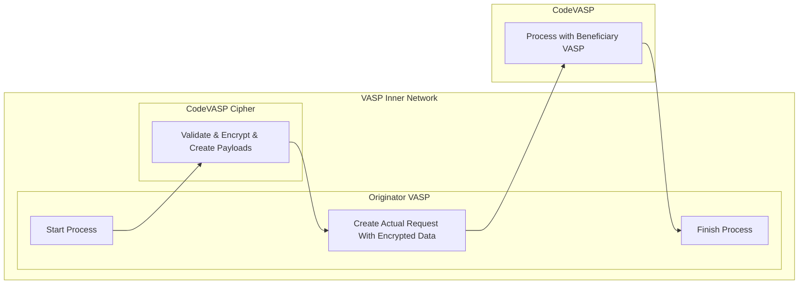

# 04_Technical FAQ

## 1. How should API withdrawals be handled to comply with the Travel Rule?

When your policies allow users or systems to initiate withdrawals via an API, compliance with the Travel Rule remains mandatory.

When a user initiates a withdrawal through an API, you must collect the required Travel Rule data directly from the user's API input parameters. It is strongly recommended to first transmit and verify this Travel Rule data using the registered information. Only after receiving a valid and approved response from the beneficiary VASP should the actual on-chain transaction be executed.

#### VASP List API Pattern

Major exchanges that support API-based withdrawals typically provide a dedicated **VASP List API** endpoint. This allows the calling system to first query the list of supported beneficiary VASPs, and then pass the selected VASP as an enumerated value (`ENUM`) in the withdrawal request. This ensures the correct, verified VASP identifier is always transmitted with the Travel Rule payload — rather than relying on error-prone free-text input.

### Beneficiary Information Parameters

In addition to the VASP identifier, major exchanges include dedicated **beneficiary info parameters** directly in their withdrawal API to collect Travel Rule data at the point of transaction. Below are real-world examples:

#### Bybit — [`POST /v5/asset/withdraw/create`](https://bybit-exchange.github.io/docs/v5/asset/withdraw)

Bybit provides a dedicated [VASP list endpoint](https://bybit-exchange.github.io/docs/v5/asset/withdraw/vasp-list) to retrieve supported destination VASPs. The withdrawal API then accepts the following Travel Rule-related parameters:

| Parameter | Required | Description |
|-----------|----------|-------------|
| `vaspEntityId` | ✅ Required (KR users) | VASP identifier, selected from the VASP list API. Use `"others"` if unknown. |
| `beneficiaryName` | ✅ Required (KR users) | Full name of the beneficiary as registered with the target exchange (KYC name). |
| `beneficiaryWalletType` | Required (TR/KZ users) | `0` = exchange wallet, `1` = unhosted/private wallet |

---

#### OKX — [`POST /api/v5/asset/withdrawal`](https://www.okx.com/docs-v5/en/#funding-account-rest-api-withdrawal)

OKX provides a [Get Exchange List (public)](https://www.okx.com/docs-v5/en/#funding-account-rest-api-get-exchange-list-public) endpoint to retrieve available destination exchanges. The withdrawal API accepts a nested `rcvrInfo` object for beneficiary Travel Rule data:

| Parameter | Type | Description |
|-----------|------|-------------|
| `rcvrInfo.walletType` | String | `"exchange"` for VASP wallet, `"private"` for unhosted wallet |
| `rcvrInfo.exchId` | String | Destination exchange identifier (DID format, from the exchange list API) |
| `rcvrInfo.rcvrFirstName` | String | Beneficiary's first name (e.g., `"Bruce"`) |
| `rcvrInfo.rcvrLastName` | String | Beneficiary's last name (e.g., `"Wayne"`) |

**OKX example payload with beneficiary info:**
```json
{
  "amt": "1",
  "dest": "4",
  "ccy": "BTC",
  "chain": "BTC-Bitcoin",
  "toAddr": "17DKe3kkkkiiiiTvAKKi2vMPbm1Bz3CMKw",
  "rcvrInfo": {
    "walletType": "exchange",
    "exchId": "did:ethr:0xfeb4f99829a9acdf52979abee87e83addf22a7e1",
    "rcvrFirstName": "Bruce",
    "rcvrLastName": "Wayne"
  }
}
```

Both exchanges follow the same fundamental pattern: **query the VASP/exchange list first to get an `ENUM`-compatible identifier, then include both the VASP identifier and the beneficiary's name in the withdrawal request** to satisfy Travel Rule compliance requirements.

## 2. What is the CodeVASP Cipher Module, and how should it be used?

The **CodeVASP Cipher Module** is an optional, self-contained encryption and decryption service distributed as a Docker image. It can be downloaded via the CodeVASP dashboard (using your authentication credentials) and run entirely within your own network infrastructure.

Key characteristics:
- **Air-gapped:** The module operates completely offline and has **no internet connectivity**. It does not communicate with any external server.
- **Optional:** VASPs may choose to use this module or opt out entirely, depending on their internal architecture and security requirements.
- **Scope:** Its sole responsibility is to validate input data, encrypt it, and produce a properly structured payload ready for submission to the CodeVASP Travel Rule API.

> **Important for Developers:** The CodeVASP Cipher Module should **not** be confused with the CodeVASP Travel Rule API server. The module itself does **not** transmit Travel Rule data. Its output (the encrypted payload) must be used as the input to the CodeVASP API. The correct usage flow is as follows:



The four steps in the flow are:
1. **Start → Cipher:** The originating VASP sends the raw transfer data to the CodeVASP Cipher module running locally within its network.
2. **Cipher → Request:** The Cipher module validates, encrypts, and produces a properly structured payload, which is passed back to the originating VASP's process.
3. **Request → CodeVASP:** The originating VASP uses the encrypted payload to call the CodeVASP Travel Rule API, which then coordinates with the Beneficiary VASP.
4. **CodeVASP → Finish:** The result is returned to the originating VASP to complete the flow.

---

## 3. Is it mandatory to use the CodeVASP Cipher module?

The Cipher module is **mandatory for ID Connect**. For all other integration types, it is optional — however, using it can significantly reduce overall development time by offloading encryption logic.

## 4. How often should the VASP List Search API be called?

The list of VASPs integrated with CodeVASP does not fluctuate frequently enough to require real-time queries on every transaction. For cost-efficient operation, it is recommended to cache the list and refresh it at an appropriate scheduled interval (e.g., daily or on-demand), rather than calling it per request.

## 5. What field should `accountNumber` contain — the user's wallet address or the exchange's wallet address?

The `accountNumber` field must contain the **user's wallet address**. To qualify as valid Travel Rule data, the address must clearly identify the originator or beneficiary as a natural or legal person. Additionally, using the user's wallet address ensures that assets can be safely returned if the transaction is canceled.

## 6. Should `currency` be the network symbol or the coin symbol?

The `currency` field should be the **coin symbol** (also known as the coin ticker, e.g., `BTC`, `ETH`, `USDT`). The value is **case-insensitive**.

## 7. How should `tradePrice` and `tradeCurrency` be calculated and entered?

`tradePrice` refers to the total value of the virtual asset converted into **fiat currency**. If in-house pricing data is unavailable, use a pricing API from another VASP to compute the value.

**Example:** Transferring 2 BTC at a current price of $42,708:
> 42,708 × 2 = **$85,416**

```json
"tradePrice": "85416",
"tradeCurrency": "USD"
```

`tradeCurrency` must be a valid fiat currency code following the **ISO 4217** standard. Supported currencies include:

| Country | Currency |
|---------|----------|
| 🇺🇸 United States | USD |
| 🇰🇷 South Korea | KRW |
| 🇪🇺 European Union | EUR |
| 🇯🇵 Japan | JPY |
| 🇨🇳 China | CNY |
| 🇬🇧 United Kingdom | GBP |
| 🇨🇦 Canada | CAD |
| 🇦🇺 Australia | AUD |
| 🇭🇰 Hong Kong | HKD |
| 🇸🇬 Singapore | SGD |

If you need to use a currency not listed above, please contact the CodeVASP team.

## 8. What are the required fields in IVMS101?

Please refer to the `04 - IVMS101-part3` documentation for a full breakdown of required and optional fields across all person types (natural and legal) for both the Originator and Beneficiary.

## 9. What are Request API and Response API?

Request API is used to send Travel Rule data to the CodeVASP Travel Rule API. Therefore, it is called by the Originator VASP.
Response API is used to receive Travel Rule data from the CodeVASP Travel Rule API. Therefore, the traffic will go to the Beneficiary VASP.
