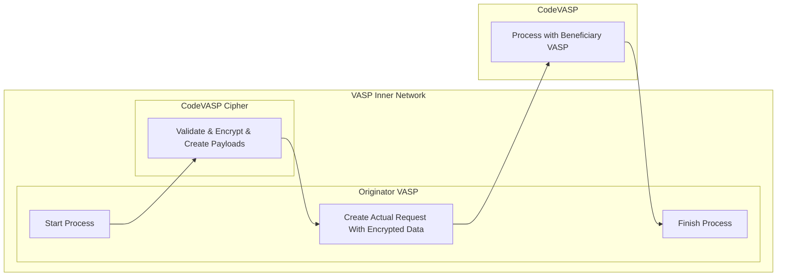

# 02 - Encryption Decryption

## 1. Encryption Approach
- When communicating between VASPs, user personal information must always be end-to-end encrypted.
- Before sending a request to CodeVASP, the VASP must encrypt the Travel Rule data.
- While HTTPS ensures baseline security, personal information is additionally encrypted as part of the payload object, so that only the participating VASPs can decrypt it.(This applies equally when interoperating with other protocols.)

> You can choose between two encryption methods.
> - OPTION1. Use the Cipher module provided by CodeVASP →Move to 2. Cipher
> - OPTION2. Custom Encryption → Move to 3. Custom Encryption
## 2. Cipher Module
- Cipher is CodeVASP's encryption module, distributed as a Docker image.
* Please read [02-1. CodeVASP-Cipher Server Module Guide] and follow the instructions in the guide.
* Use the Cipher response **as-is** for the CodeVASP API request.

## 3. Custom Encryption
- Refer to the sample code if you perform encryption and decryption without using Cipher.
* Click the [link](https://code-webpage.s3.ap-northeast-2.amazonaws.com/sample-code/v1.8.7.zip) to download the file.
## 4. By APIs
- Explains which APIs require encryption during request and response.
- A signature is required for all requests

| API                                                                                                                                           | Request | Response |
| --------------------------------------------------------------------------------------------------------------------------------------------- | ------- | -------- |
| VASP List Search<br />Public Key Search<br />Networks by Coin<br />Search VASP by Wallet Request<br />Search VASP by Wallet Result                    | X       | X        |
| Virtual Asset Address Search                                                                                                                  | O       | X        |
| Asset Transfer Authorization                                                                                                                  | O       | O        |
| Report Transfer Result (TX Hash)<br />Transaction Status Search<br />Finish Transfer<br />Search VASP by TXID Request<br />Search VASP by TXID Result | X       | X        |
| Asset Transfer Data Request)                                                                                                                  | O       | O        |
## 5. Algorithm library

### 5-1. Recommended Library
* libsodium (Networking and Cryptography library)
* Public-key cryptography – Authenticated encryption
### 5-2. Algorithm
* Key exchange: [X25519](https://doc.libsodium.org/advanced/ed25519-curve25519)
* Encryption: [XSalsa20](https://doc.libsodium.org/advanced/stream_ciphers/xsalsa20)
* Authentication: Poly1305
### 5-3. Key Pair
* Signing Key: A private key used for producing digital signatures using the Ed25519 algorithm. Within CodeVASP protocol, this is referred to as the **Private Key**.
* Verify Key: The public key counterpart to an Ed25519 Signing Key, used for producing digital signatures. Within CodeVASP protocol, this is referred to as the **Public Key**.
## 6. Generating Key Pair
### 6-1. Create from the dashboard
Log in to our [dashboard](https://alliances.codevasp.com/), and you can generate one at `Development - Environment Info`
### 6-2. Use the provided sample code
```python
from base64 import b64encode

from nacl.signing import SigningKey

signing_key = SigningKey.generate()
verify_key = signing_key.verify_key

# use signing key as private key
private_key_b64 = b64encode(bytes(signing_key)).decode('utf-8')

# use verify key as public key
public_key_b64 = b64encode(bytes(verify_key)).decode('utf-8')

print("Key generation complete.")
print("sk: " + private_key_b64)
print("pk: " + public_key_b64)


```


> - If you lose the Private Key, you will need to regenerate the key pair.
> - Enter the Public Key in `Development - Environment Info` on the dashboard

## 7. Example for encryption

### 7-1. Original message

```json
{
    "currency": "XRP",
    "payload": {
        "ivms101": {
            "Beneficiary": {
                "accountNumber": [
                    "rHcFoo6a9qT5NHiVn1THQRhsEGcxtYCV4d:memo or tag"
                ]
            }
        }
    }
}
```
1. The target of encryption is the payload object, `{"ivms101": ...}` part is encrypted.
2. VASP A on the sending side encrypts using the public key of VASP B on the receiving side and it's (VASP A) private key.
3. The payload value is overwritten by encoding the encrypted result with base64.
4. The `payload` type is changed from object to String.
### 7-2. Encrypted message example

```json
{
    "currency": "xrp",
    "payload": "base64 encoded string"
}
```
- Beneficiary VASP performs decoding, by entering the public key of the originator VAS and the private key of Beneficiary VASP.
## 8. Signature generation rule

- The Signature included in the header is generated by concatenating the following three values as a byte array and signing them with the sender VASP's private key (signing key):
	1. X-Code-Req-Datetime
	2. Body string
	3. X-Code-Req-Nonce
- The CodeVASP server verifies the signature using the registered public key.
## 9. For Reference
* Sample code available in Python, Java, JavaScript, and Go
* Support available through official channels
