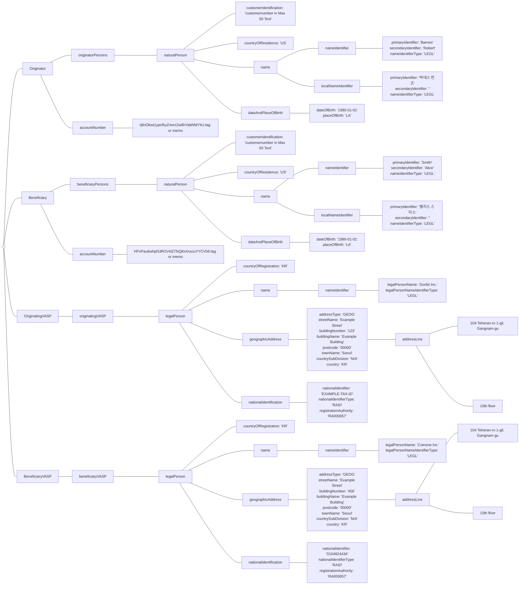
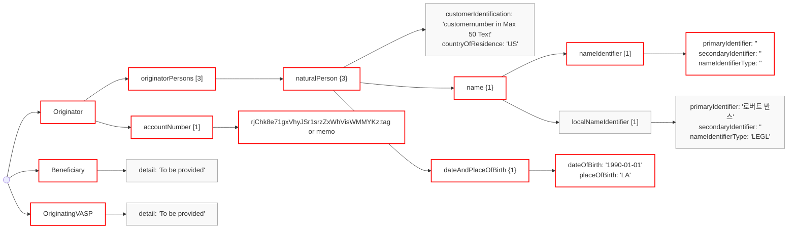
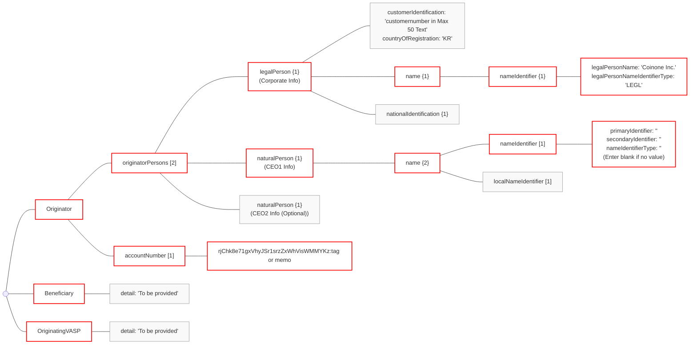
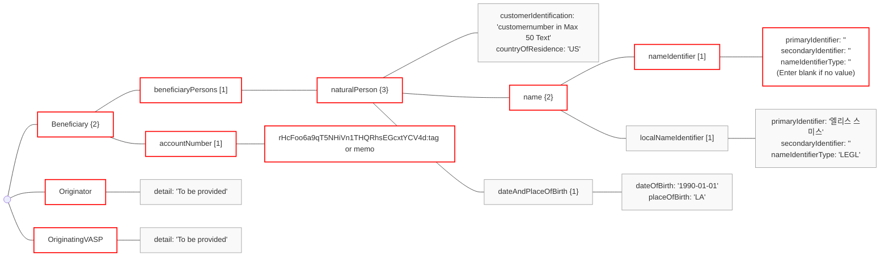
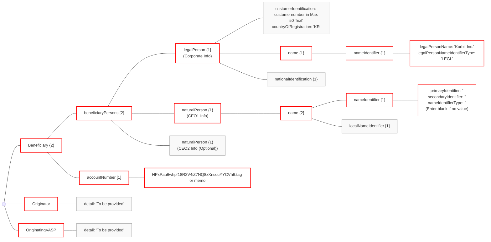
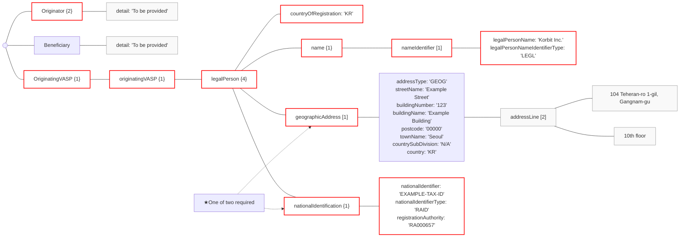
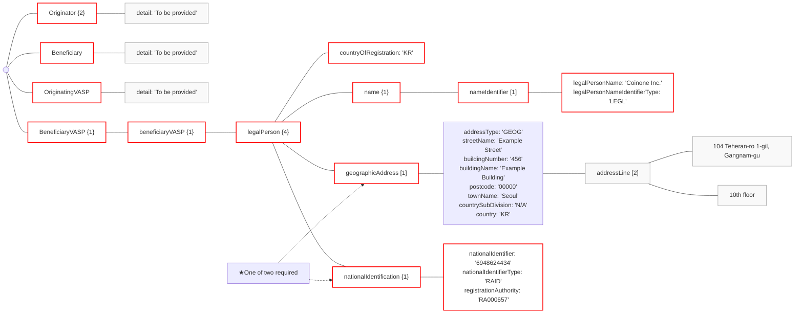

# 04 - IVMS101-part3

# 3. IVMS101 Required Fields

IVMS101 features a complex structure, as illustrated above. The provided diagram is merely one example; scenarios vary depending on the classification as 'naturalPerson'/'legalPerson' and the use of 'localNameIdentifier'.

As required fields differ across sending and receiving cases, understanding each scenario thoroughly and entering the necessary details is required.

Although the structure appears complex, effectively handling the four essential elements—'Originator', 'Beneficiary', 'OriginatingVASP', and 'BeneficiaryVASP'—ensures a smooth process. The originating VASP shall incorporate 'Originator', 'Beneficiary', and 'OriginatingVASP' information into the 'payload' as per the IVMS101 standard and dispatch the request. The beneficiary VASP then finalizes the process by adding 'BeneficiaryVASP' details to the received data and issuing a response.

We will now review the key IVMS101 objects for common cases.

## 3-1. As an Originator
### 3-1-1. 'Originator': 'naturalPerson'

* When the originator is an individual, under the 'name' object, 'nameIdentifier' is required, whereas 'localNameIdentifier' is optional.
* Since **the 'nameIdentifier' is required, enter blank** if there is no matching value.
* But when communicating **between Korean VASPs**, it is agreed that the 'nameIdentifier' will contain the Korean name and the 'localNameIdentifier' will contain the English name.
 

### 3-1-2. 'Originator': 'legalPerson'

* When the originator is a corporate entity,  under the 'originatorPersons' object, **both a 'legalPerson' and at least one 'naturalPerson' are required**.
* The 'legalPerson' object contains corporate details, while 'naturalPerson' includes the corporate representative(CEO)'s information.
* Under the 'name' object, **'nameIdentifier' is required**, whereas 'localNameIdentifier' is optional.
* Since **the 'nameIdentifier' is required, enter blank** if there is no matching value.
* If there are multiple corporate representatives, add as many 'naturalPerson' objects as needed to the 'beneficiaryPersons' array.
* The 'nameIdentifier' contains the English name, while the 'localNameIdentifier' holds the Korean name (or other local language names).
* But when communicating **between Korean VASPs**, it is agreed that the 'nameIdentifier' will contain the Korean name and the 'localNameIdentifier' will contain the English name.
 

### 3-1-3. 'Beneficiary': 'naturalPerson'

- When the beneficiary is an individual, under the 'name' object, **'nameIdentifier' is required**,  whereas 'localNameIdentifier' is optional.
- Since **the 'nameIdentifier' is required, enter blank** if there is no matching value.
- The 'nameIdentifier' contains the English name, while the 'localNameIdentifier' holds the Korean name (or other local language names).
- But when communicating **between Korean VASPs**, it is agreed that the 'nameIdentifier' will contain the Korean name and the 'localNameIdentifier' will contain the English name.
 

### 3-1-4. 'Beneficiary': 'legalPerson'

* Under the 'originatorPersons' object, both a 'legalPerson' and at least one 'naturalPerson' are required.
* The 'legalPerson' object contains corporate details, while 'naturalPerson' includes the corporate representative(CEO)'s information.
* Under the 'name' object, **'nameIdentifier' is required**,  whereas 'localNameIdentifier' is optional.
* Since **the 'nameIdentifier' is required, enter blank** if there is no matching value.
* If there are multiple corporate representatives, add as many 'naturalPerson' objects as needed to the 'beneficiaryPersons' array.
* The 'nameIdentifier' contains the English name, while the 'localNameIdentifier' holds the Korean name (or other local language names).
* - But when communicating **between Korean VASPs**, it is agreed that the 'nameIdentifier' will contain the Korean name and the 'localNameIdentifier' will contain the English name.
 

### 3-1-5. 'OriginatingVASP'

- The 'OriginatingVASP' object contains information about the sending VASP.
- Under 'legalPerson', both 'name' and 'countryOfRegistration' are required, and either 'geographicAddress' or 'nationalIdentification' should also be entered.
- When using 'nationalIdentification', it's recommended to include 'registrationAuthority', the details of the issuing body. Download the 'GLEIF Registration Authorities List' from the bottom of the [GLEIF website](https://www.gleif.org/en/about-lei/code-lists/gleif-registration-authorities-list), locate the Authority Code that corresponds with your country and registration type.
  

### 3-1-6. 'BeneficiaryVASP'

* The receiving VASP adds their 'BeneficiaryVASP' information to the 'Originator', 'Beneficiary', and 'OriginatingVASP' information contained in the 'Asset Transfer Authorization Request' and sends it back to the originating VASP.
* Under 'legalPerson', both 'name' and 'countryOfRegistration' are required, and either 'geographicAddress' or 'nationalIdentification' should also be entered.
* When using 'nationalIdentification', it's recommended to include 'registrationAuthority', the details of the issuing body. Download the 'GLEIF Registration Authorities List' from the bottom of the [GLEIF website](https://www.gleif.org/en/about-lei/code-lists/gleif-registration-authorities-list), locate the Authority Code that corresponds with your country and registration type..