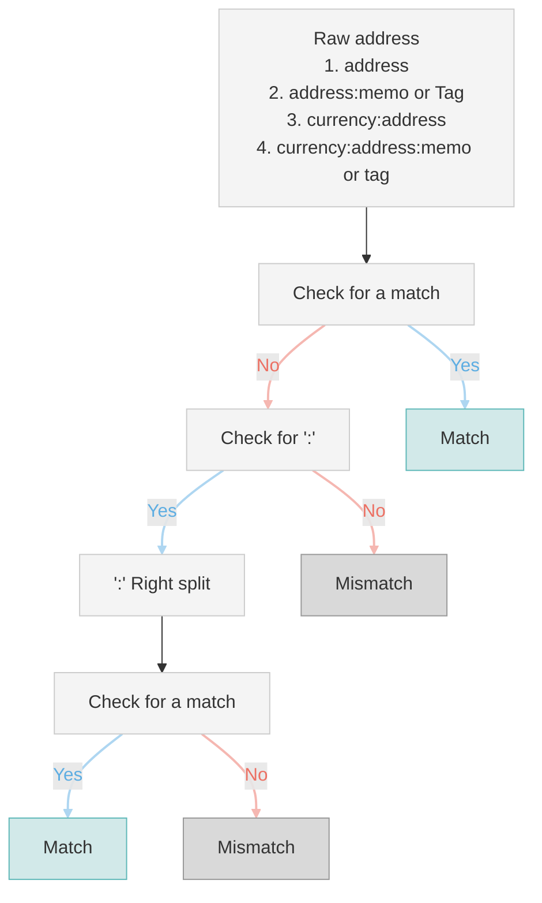
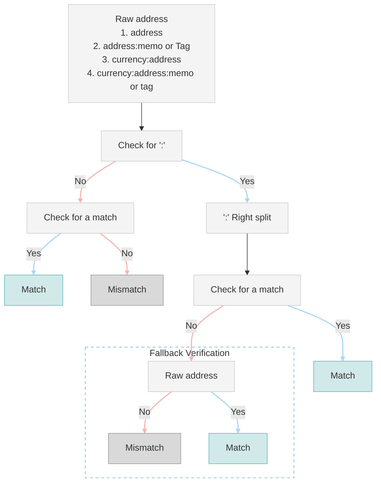

# 05 - Verifying Wallet Address

A wallet address may have various formats, combining the address itself, a tag or memo, and a delimiter. It's crucial to note that in the IVMS101 protocol, this entire combination is treated as a single string. Thus, there are 4 possible formats of wallet addresses.

| No | Description                                       | Example Assets                                                      | Address Format             |
| :- | :------------------------------------------------ | :------------------------------------------------------------------ | :------------------------- |
| 1  | Address only                                      | BTC , ETH…                                                          | address                    |
| 2  | Combination of address and tag or memo            | EOS,  XRP…                                                          | address:memo or tag        |
| 3  | ':' included in the address                       | BCH, Kaspa…                                                         | prefix:address             |
| 4  | ':' included in the address and tag or memo added | Not existing at the moment, but potentially possible in the future. | prefix:address:memo or tag |

## 1. Verify Address First

1. Verify address with the received string as it is.
2. If it fails, check if the string contains a ':'. If so, split the string at the rightmost colon.
3. Re-verify with the first segment of the splitted string.

> **📌Tips**
> * When splitting, regardless of colon count, use the **rightmost colon** as the basis.
> * You must first try **verifying the received string**, irrespective of the presence of a colon.

## 2. Verify ':' first

1. Verify the address directly if no colon (':') is present.
2. If a colon is present, split the string at the rightmost colon and verify the address using the first segment.
3. If it fails, verify the existence of the address using the received string as it is, including the colon.