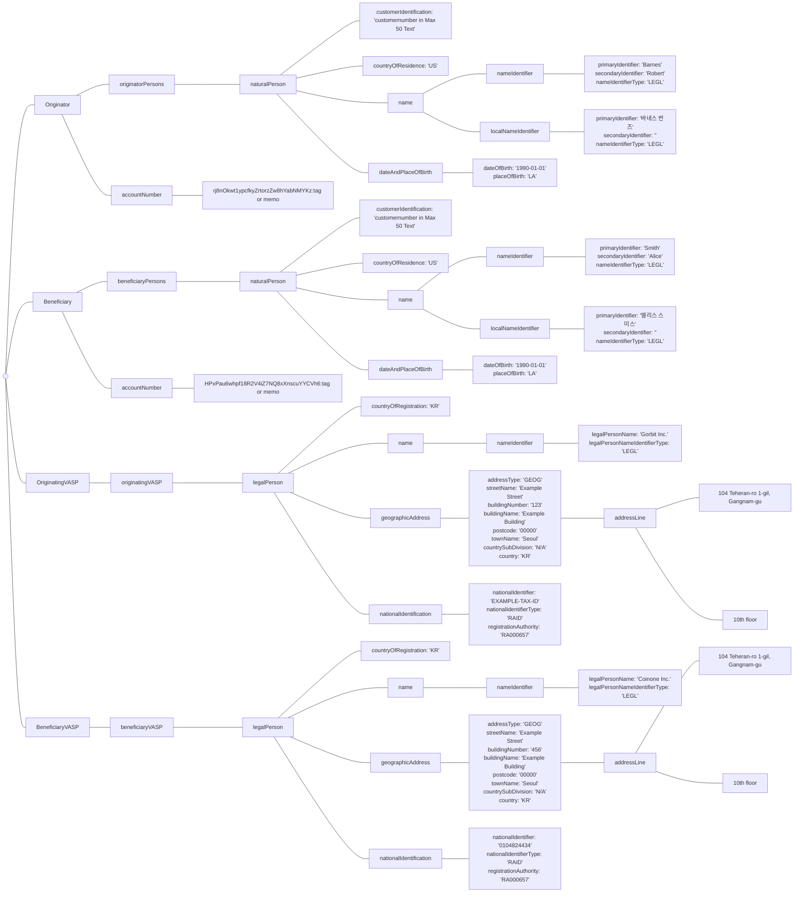
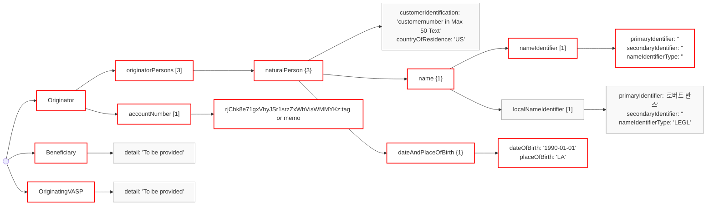
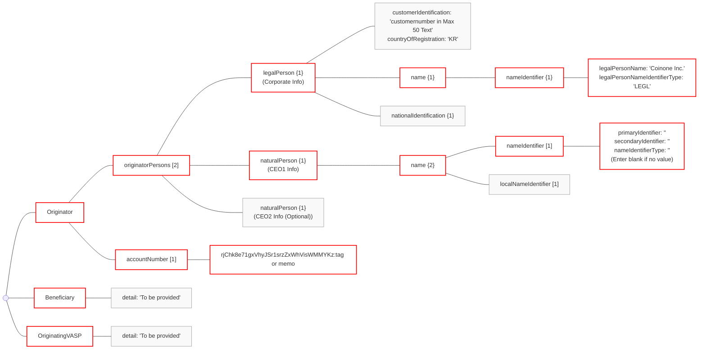
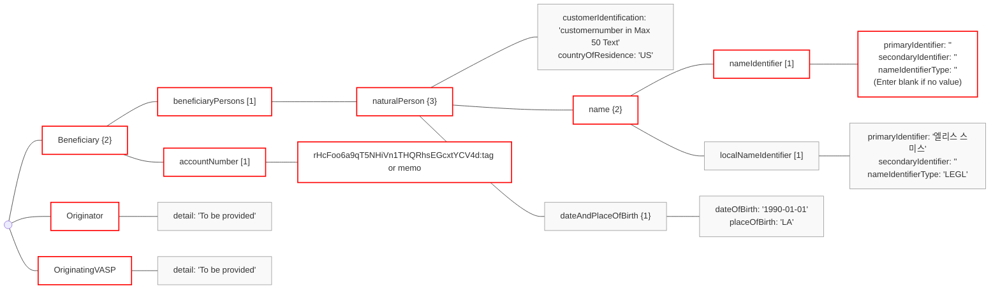
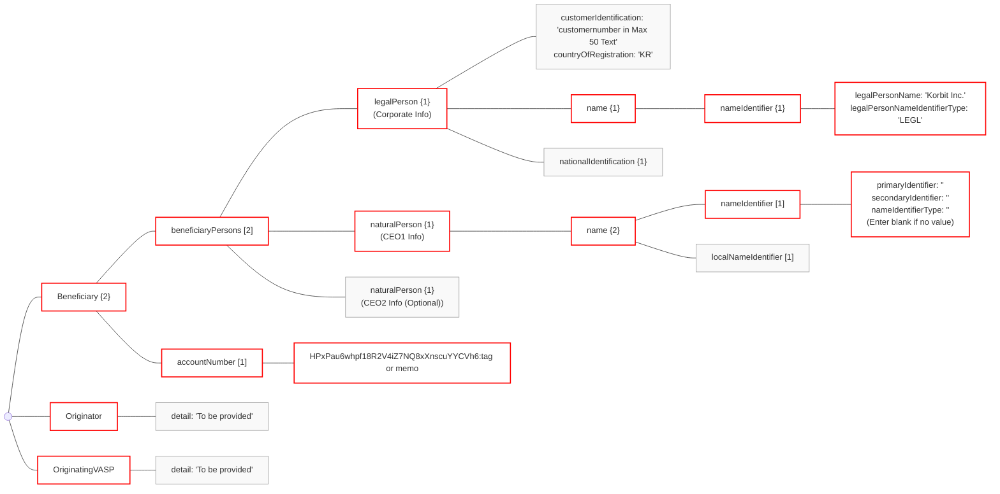
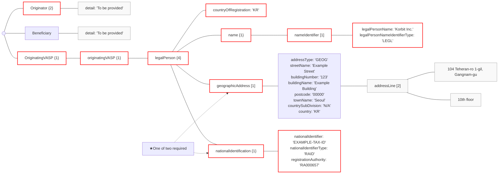
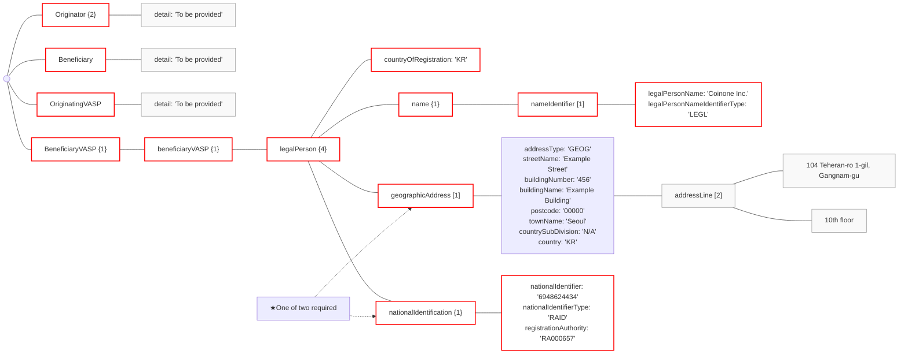

# Dev 04 - IVMS101-part2

# 1. IVMS101
- IVMS101 is a standardized Travel Rule data format for secure and interoperable exchange between VASPs.
## 1-1. Reference Materials
* Please find the official IVMS101 guide by InterVASP [Here](https://www.intervasp.org/).
* Please refer to the json schema and examples [here](https://github.com/codevasp-lab/ivms101/blob/main/README.md) .
* [CodeVASP Github](https://github.com/codevasp-lab/ivms101)
## 1-2. Formatting Rules
* Field names in the message should be written in camelCase, starting with a lowercase letter.
* However, entities defined in IVMS101—namely Originator, Beneficiary, OriginatorVASP, and BeneficiaryVASP—should be written in PascalCase.
* All field values are case-insensitive unless otherwise specified.
* All field values must be expressed as UTF-8 encoded strings, including booleans, integers, and floats.
* English should be used for all field values, unless Korean is explicitly allowed.
## 1-3. IVMS101 Version
IVMS101 has been updated once since its release, resulting in two versions:
* IVMS101.2020: Initial version
* IVMS101.2023: Updated in 2024
Currently, all global Travel Rule solutions universally adopt IVMS101.2020, and all of CodeVASP's guide content is based on this version.
Using different versions of the IVMS101 protocol between VASPs can disrupt communication. To ensure proper functionality, always adhere to the instructions outlined in the documentation when implementing.
# 2. IVMS101 Type
- IVMS101 is described object by object to guide the construction of the payload.
### IVMS101 as an originator VASP
As an originator VASP, you need to send following to beneficiary VSAP. You should know the entityId of beneficiary from CodeVASP, however, you still do not know their VASP information, thus, only send following objects.
```
{ 
  "ivms101" : {  
    "Originator": {...},  
    "Beneficiary": {...},  
    "OriginatingVASP": {...}  
  }
}
```
### IVMS101 as a beneficiary VASP
When beneficiary VASP response to originator, it should complete the IVMS101 format as following.
* You may also include more Beneficiary information in Beneficiary Object such as `customerIdentification`.
```
{ 
  "ivms101" : {  
    "Originator": {...},  
    "Beneficiary": {...},  
    "OriginatingVASP": {...},
    "BeneficiaryVASP": {...}                   
  }
}
```
## 2-0. ivms101 
| Name            | Required | Type                                | Description                                                                      |
| :-------------- | :------- | :---------------------------------- | :------------------------------------------------------------------------------- |
| Originator      | Required | Originator      | An object that contains the information of the user sending the virtual asset.   |
| Beneficiary     | Required | Beneficiary       | An object that contains the information of the user receiving the virtual asset. |
| OriginatingVASP | Required | OriginatingVASP| An object that contains the information of the VASP sending the virtual asset.   |
| BeneficiaryVASP | Optional | BeneficiaryVASP | An object that contains the information of the VASP receiving the virtual asset. |

## 2-1. Originator
-  Details associated with the identity information of the sender (the person sending the virtual asset).

| Name              | Required | Type                      | Description                                                                                                                           |
| :---------------- | :------- | :------------------------ | :------------------------------------------------------------------------------------------------------------------------------------ |
| originatorPersons | Required | array\<Person> | An object designed to hold the information of the sender.                                                                             |
| accountNumber     | Required | array\<String>            | The wallet address of the user sending the asset. If a tag or memo value is required, it should be appended using ':' as a separator. |
## 2-2. Beneficiary
- Details associated with the identity information of the recipient (the person receiving the virtual asset).

| Name               | Required | Type                      | Description                                                                                                                 |
| :----------------- | :------- | :------------------------ | :-------------------------------------------------------------------------------------------------------------------------- |
| beneficiaryPersons | Required | array\<Person> | An object designed to contain the information of the recipient.                                                             |
| accountNumber      | Required | array\<String>            | The wallet address of the user receiving the asset, with a tag or memo value appended using ':' as a separator if required. |

## 2-3. OriginatingVASP
- Information about the Virtual Asset Service Provider (VASP) on the sender's side.

| Name            | Required | Type              | Description                                                     |
| :-------------- | :------- | :---------------- | :-------------------------------------------------------------- |
| originatingVASP | Optional | Person | An object designed to hold the information of the sending VASP. |

## 2-4. BeneficiaryVASP
- Information about the Virtual Asset Service Provider (VASP) on the recipient's side.

| Name            | Required | Type              | Description                                                          |
| :-------------- | :------- | :---------------- | :------------------------------------------------------------------- |
| beneficiaryVASP | Optional | Person | An object designed to contain the information of the receiving VASP. |

### 2-1-1. Address
- Information representing the geographical address of an individual or a corporation.

| Name               | Required | Type                                | Description                                        |
| :----------------- | :------- | :---------------------------------- | :------------------------------------------------- |
| addressType        | Required | AddressTypeCode | An object that represents the type of address.     |
| townName           | Required | String                              | City name                                          |
| country            | Required | CountryCode        | Country of residence                               |
| department         | Optional | String                              | Department of a large organization or building     |
| subDepartment      | Optional | String                              | Sub-department of a large organization or building |
| streetName         | Optional | String                              | Street name                                        |
| buildingNumber     | Optional | String                              | Building number                                    |
| buildingName       | Optional | String                              | Building name                                      |
| floor              | Optional | String                              | Floor                                              |
| postBox            | Optional | String                              | Post box                                           |
| room               | Optional | String                              | Room number                                        |
| postcode           | Optional | String                              | Zip code, Postal code                              |
| townLocationName   | Optional | String                              | Name of a specific location within a city          |
| districtName       | Optional | String                              | District                                           |
| countrySubDivision | Optional | String                              | Division within a country                          |
| addressLine        | Optional | array\<String>                      | Detailed address                                   |
### 2-1-2. AddressTypeCode
- A code used to identify the classification or type of an address.

| Code | Name        | Description                                                                                                           |
| :--- | :---------- | :-------------------------------------------------------------------------------------------------------------------- |
| HOME | Residential | Address is the home address.                                                                                          |
| BIZZ | Business    | Address is the business address.                                                                                      |
| GEOG | Geographic  | Address is the unspecified physical(geographical) address suitable for identification of the natural or legal person. |

### 2-1-3. CountryCode
* Two-letter country code determined by ISO-3166-1 alpha-2. e.g.) `KR`, `JP`, `US`, etc.
* [https://www.iso.org/obp/ui/#search](https://www.iso.org/obp/ui/#search)

### 2-1-4. DateAndPlaceOfBirth
- Information regarding the date of birth and place of birth.


| Name         | Required | Type   | Description    |
| :----------- | :------- | :----- | :------------- |
| dateOfBirth  | Required | Date   | Date of birth  |
| placeOfBirth | Required | String | Place of birth |

### 2-1-5. LegalPerson
- Information about a corporation.
- Either `geographicAddress` or `nationalIdentification` is mandatory.

| Name                   | Required | Type                                              | Description                                                                                                                                              |
| :--------------------- | :------- | :------------------------------------------------ | :------------------------------------------------------------------------------------------------------------------------------------------------------- |
| name                   | Required | LegalPersonName              | An object containing the official name information of a corporation.                                                                                     |
| geographicAddress      | Optional | array\<Address>                       | An object containing the address information of a corporation.                                                                                           |
| customerIdentification | Optional | String                                            | A unique number assigned by a VASP to identify a corporation as a customer.                                                                              |
| nationalIdentification | Optional | NationalIdentification | An object containing numbers such as the corporate registration number and tax identification number, used for official identification of a corporation. |
| countryOfRegistration  | Required | CoununtryCode     | Country of registration                                                                                                                                  |
### 2-1-6. LegalPersonName
- Information related to the name of the corporation.

| Name                   | Required | Type                                                      | Description                                                                          |
| :--------------------- | :------- | :-------------------------------------------------------- | :----------------------------------------------------------------------------------- |
| nameIdentifier         | Required | array\<LegalPersonNameID>           | An object that can include one or more names, such as legal names, trade names, etc. |
| localNameIdentifier    | Optional | array\<LocalLegalPersonNameID> | An object containing the name of the corporation in the local language.              |
| phoneticNameIdentifier | Optional | array\<LocalLegalPersonNameID> | An object containing phonetic names based on pronunciation.                          |

### 2-1-7. LegalPersonNameID
- Information for specifically identifying the name of the corporation.

| Name                          | Required | Type                                                | Description                                                                       |
| :---------------------------- | :------- | :-------------------------------------------------- | :-------------------------------------------------------------------------------- |
| legalPersonName               | Required | String                                              | The name of the corporation as used in legal documents or official registrations. |
| legalPersonNameIdentifierType | Required |LegalPersonNameTypeCode | An object representing the type of corporation name.                              |

### 2-1-8. LegalPersonNameTypeCode
- A code used to distinguish the types of corporation names.

| Code | Name         | Description                                                                                                                                          |
| :--- | :----------- | :--------------------------------------------------------------------------------------------------------------------------------------------------- |
| LEGL | Legal name   | Official name under which an organisation is registered.                                                                                             |
| SHRT | Short name   | Specifies the short name of the organisation.                                                                                                        |
| TRAD | Trading name | Name used by a business for commercial purposes, although its registered legal name, used for contracts and other formal situations, may be another. |

### 2-1-9. LocalLegalPersonNameID
- Information expressing the name of the corporation in the local language of the region or country where the corporation is located.

| Name                          | Required | Type                                                | Description                                                |
| :---------------------------- | :------- | :-------------------------------------------------- | :--------------------------------------------------------- |
| legalPersonName               | Required | String                                              | The name of the corporation in the local language.         |
| legalPersonNameIdentifierType | Required | LegalPersonNameTypeCode| An object representing the type of the corporation's name. |

### 2-1-10. LocalNaturalPersonNameID
- Information for identifying an individual's (natural person's) name according to the local region or language.


| Name                | Required | Type                                                    | Description                                                                                                          |
| :------------------ | :------- | :------------------------------------------------------ | :------------------------------------------------------------------------------------------------------------------- |
| primaryIdentifier   | Required | String                                                  | Enter the last name (surname), and if it cannot be separated, indicate the surname and first name in order together. |
| secondaryIdentifier | Optional | String                                                  | Enter the first name, and if it cannot be separated, omit it.                                                        |
| nameIdentifierType  | Required | NaturalPersonNameTypeCode| An object that represents the type of name., Default: 'LEGL'(=Legal)                                                 |

### 2-1-11. NationalIdentification
- Information about a unique identification number or code used to identify an individual.

| Name | Required | Type | Description |
| --- | --- | --- | --- |
| nationalIdentifier | Required | String | A unique identification number for an individual or corporation.|
| nationalIdentifierType | Required| NationalIdentifierTypeCode | An object representing the type of identification number. |
| countryOfIssue | Optional | CountryCode | The country where the identification number was issued. (only used with 'naturalPerson') |
| registrationAuthority | Optional | RegistrationAuthority | - An object containing information about the institution that issued the identification number. <br /> -Used only when the value of 'nationalIdentifierType' is not 'LEIX'. |

### 2-1-12. NationalIdentifierTypeCode
- A code used to distinguish the types of an individual's national identification number.

| Code | Name                               | Description                                                                                                                                    |
| :--- | :--------------------------------- | :--------------------------------------------------------------------------------------------------------------------------------------------- |
| ARNU | Alien registration number          | Number assigned by a government agency to identify foreign nationals.                                                                          |
| CCPT | Passport number                    | Number assigned by a passport authority.                                                                                                       |
| RAID | Registration authority identifier  | Identifier of a legal entity as maintained by a registration authority.                                                                        |
| DRLC | Driver license number              | Number assigned to a driver's license.                                                                                                         |
| FIIN | Foreign investment identity number | Number assigned to a foreign investor(other than the alien number).                                                                            |
| TXID | Tax identification number          | Number assigned by a tax authority to an entity.                                                                                               |
| SOCS | Social security number             | Number assigned by a social security agency.                                                                                                   |
| IDCD | Identity card number               | Number assigned by a national authority to an identity card.                                                                                   |
| LEIX | Legal Entity Identifier            | Legal Entity Identifier (LEI) assigned in accordance with ISO 174421                                                                           |
| MISC | Unspecified                        | A national identifier which may be known but which cannot otherwise be categorized or the category of which the sender is unable to determine. |


### 2-1-13. NaturalPerson
- Information that can clearly identify an individual (natural person), such as identification information, address, national identification number, etc.

| Name                   | Required | Type                                        | Description                                                                           |
| :--------------------- | :------- | :------------------------------------------ | :------------------------------------------------------------------------------------ |
| name                  | Required | NaturalPersonName   | An object designed to contain name information.                                       |
| dateAndPlaceOfBirth    | Optional | DateAndPlaceOfBirth | An object designed to contain information about the date of birth and place of birth. |
| customerIdentification | Optional | String                                      | An identifier (UID or IDX) assigned by a VASP to distinguish users.                   |
| countryOfResidence     | Optional | CountryCode                 | Information about the country of residence.                                           |

### 2-1-14. NaturalPersonName
- Information regarding the name of an individual (natural person).

| Name                   | Required | Type                                                 | Description                                                                                                                                                 |
| :--------------------- | :------- | :--------------------------------------------------- | :---------------------------------------------------------------------------------------------------------------------------------------------------------- |
| nameIdentifier         | Required | array\<NaturalPersonNameID>  | An object for entering the legal name. When transacting between domestic VASPs, enter in Korean, and when transacting with foreign VASPs, enter in English. |
| localNameIdentifier    | Optional | array\<NaturalPersonNameID>  | An object for providing the Local name additionally when transacting with foreign VASPs.                                                                    |
| phoneticNameIdentifier | Optional | array\<NaturalPersonNameID> | An object containing phonetic names based on pronunciation.|

### 2-1-15. NaturalPersonNameID
- Specific identification information regarding the name of an individual (natural person).

| Name                | Required | Type                                                    | Description                                                                                                      |
| :------------------ | :------- | :------------------------------------------------------ | :--------------------------------------------------------------------------------------------------------------- |
| primaryIdentifier   | Required | string                                                  | Enter the last name (surname), and if it cannot be separated, list the surname and first name together in order. |
| nameIdentifierType  | Required | NaturalPersonNameTypeCode | An object that represents the type of name., Default: 'LEGL'(=Legal)                                             |
| secondaryIdentifier | Optional | string                                                  | Enter the first name, and if it cannot be separated, omit it.                                                    |


### 2-1-16. NaturalPersonNameTypeCode 
- A code used to distinguish the types of an individual's (natural person's) name.


| Code | Name          | Description                                                                                                                                        |
| :--- | :------------ | :------------------------------------------------------------------------------------------------------------------------------------------------- |
| ALIA | Alias name    | A name other than the legal name by which a natural person is also known.                                                                          |
| BIRT | Name at birth | The name given to a natural person at birth.                                                                                                       |
| MAID | Maiden name   | The original name of a natural person who has changed their name after marriage.                                                                   |
| LEGL | Legal name    | The name that identifies a natural person for legal, official or administrative purposes.                                                          |
| MISC | Unspecified   | A name by which a natural person maybe known but which cannot otherwise be categorized or the category of which the sender is unable to determine. |

### 2-1-17. Person

- Information used to distinguish individuals or natural persons involved in a transaction.**Either `naturalPerson` or `legalPerson` is mandatory.**

| Name          | Required | Type                            | Description                                                |
| :------------ | :------- | :------------------------------ | :--------------------------------------------------------- |
| naturalPerson | Optional | NaturalPerson | An object designed to set information about an individual. |
| legalPerson   | Optional | LegalPerson     | An object designed to set information about a corporation. |

### 2-1-18. RegistrationAuthority
* An 8-digit code representing the corporate registration authority.
* Type: Text
* Format: RA000099
* Entire list of code can be found here: [https://www.gleif.org/en/about-lei/code-lists/gleif-registration-authorities-list](https://www.gleif.org/en/about-lei/code-lists/gleif-registration-authorities-list) (There is Excel file at the end of the page.)

## 2-5. Example 
* [Json Schema](https://github.com/codevasp-lab/ivms101/blob/main/json-schema.json)
* [Complete Example - Natural Person](https://github.com/codevasp-lab/ivms101/blob/main/complete-example.json)
* [Complete Example - Legal Person](https://github.com/codevasp-lab/ivms101/blob/main/complete-example-legal-person.json)
# 3. IVMS101 Required Fields

IVMS101 features a complex structure, as illustrated above. The provided diagram is merely one example; scenarios vary depending on the classification as 'naturalPerson'/'legalPerson' and the use of 'localNameIdentifier'.

As required fields differ across sending and receiving cases, understanding each scenario thoroughly and entering the necessary details is required.

Although the structure appears complex, effectively handling the four essential elements—'Originator', 'Beneficiary', 'OriginatingVASP', and 'BeneficiaryVASP'—ensures a smooth process. The originating VASP shall incorporate 'Originator', 'Beneficiary', and 'OriginatingVASP' information into the 'payload' as per the IVMS101 standard and dispatch the request. The beneficiary VASP then finalizes the process by adding 'BeneficiaryVASP' details to the received data and issuing a response.

We will now review the key IVMS101 objects for common cases.

## 3-1. As an Originator
### 3-1-1. 'Originator': 'naturalPerson'

* When the originator is an individual, under the 'name' object, 'nameIdentifier' is required, whereas 'localNameIdentifier' is optional.
* Since **the 'nameIdentifier' is required, enter blank** if there is no matching value.
* But when communicating **between Korean VASPs**, it is agreed that the 'nameIdentifier' will contain the Korean name and the 'localNameIdentifier' will contain the English name.
```
{
  "Originator": {
    "originatorPersons": [
      {
        "naturalPerson": {
          "name": {
            "nameIdentifier": [
              {
                "primaryIdentifier": "Doe",
                "secondaryIdentifier": "John",
                "nameIdentifierType": "LEGL"
              }
            ],
          },
          "dateAndPlaceOfBirth": {
            "dateOfBirth": "1990-01-01",
          },
          "customerIdentification":"UID"
        }
      }
    ],
    "accountNumber": [
      "rJChk8e71gxVhyJSr1srzZxWhVisWMMYKZ:tag or memo"
    ]
  },
  "Beneficiary": {
  },
  "OriginatingVASP": {
  }
}
```

### 3-1-2. 'Originator': 'legalPerson'

* When the originator is a corporate entity,  under the 'originatorPersons' object, **both a 'legalPerson' and at least one 'naturalPerson' are required**.
* The 'legalPerson' object contains corporate details, while 'naturalPerson' includes the corporate representative(CEO)'s information.
* Under the 'name' object, **'nameIdentifier' is required**, whereas 'localNameIdentifier' is optional.
* Since **the 'nameIdentifier' is required, enter blank** if there is no matching value.
* If there are multiple corporate representatives, add as many 'naturalPerson' objects as needed to the 'beneficiaryPersons' array.
* The 'nameIdentifier' contains the English name, while the 'localNameIdentifier' holds the Korean name (or other local language names).
* But when communicating **between Korean VASPs**, it is agreed that the 'nameIdentifier' will contain the Korean name and the 'localNameIdentifier' will contain the English name.

```
{
  "Originator": {
    "originatorPersons": [
      {
        "legalPerson": {
          "name": {
            "nameIdentifier": [
              {
                "legalPersonName": "CodeVASP Inc.",
                "legalPersonNameIdentifierType": "LEGL"
              }
            ]
          },
          "countryOfRegistration": "KR",
          "customerIdentification":"UID"
        }
      },
      {
        "naturalPerson": {
          "name": {
            "nameIdentifier": [
              {
                "primaryIdentifier": "Doe",
                "secondaryIdentifier": "John",
                "nameIdentifierType": "LEGL"
              }
            ],
          }
        }
      },
    ],
    "accountNumber": [
      "rJChk8e71gxVhyJSr1srzZxWhVisWMMYKZ:tag or memo"
    ]
  },
  "Beneficiary": {
  },
  "OriginatingVASP": {
    
  }
}
```

### 3-1-3. 'Beneficiary': 'naturalPerson'

- When the beneficiary is an individual, under the 'name' object, **'nameIdentifier' is required**,  whereas 'localNameIdentifier' is optional.
- Since **the 'nameIdentifier' is required, enter blank** if there is no matching value.
- The 'nameIdentifier' contains the English name, while the 'localNameIdentifier' holds the Korean name (or other local language names).
- But when communicating **between Korean VASPs**, it is agreed that the 'nameIdentifier' will contain the Korean name and the 'localNameIdentifier' will contain the English name.

```
{
  "Originator": {
  },
  "Beneficiary": {
    "beneficiaryPersons": [
      {
        "naturalPerson": {
          "name": {
            "nameIdentifier": [
              {
                "primaryIdentifier": "Doe",
                "secondaryIdentifier": "John",
                "nameIdentifierType": "LEGL"
              }
            ],
          },
        }
      }
    ],
    "accountNumber": [
      "rHcFoo6a9qT5NHiVn1THQRhsEGcxtYCV4d:tag or memo"
    ]
  },
  "OriginatingVASP": {
    
  }
}
```

### 3-1-4. 'Beneficiary': 'legalPerson'

* Under the 'originatorPersons' object, both a 'legalPerson' and at least one 'naturalPerson' are required.
* The 'legalPerson' object contains corporate details, while 'naturalPerson' includes the corporate representative(CEO)'s information.
* Under the 'name' object, **'nameIdentifier' is required**,  whereas 'localNameIdentifier' is optional.
* Since **the 'nameIdentifier' is required, enter blank** if there is no matching value.
* If there are multiple corporate representatives, add as many 'naturalPerson' objects as needed to the 'beneficiaryPersons' array.
* The 'nameIdentifier' contains the English name, while the 'localNameIdentifier' holds the Korean name (or other local language names).
* - But when communicating **between Korean VASPs**, it is agreed that the 'nameIdentifier' will contain the Korean name and the 'localNameIdentifier' will contain the English name.
```
{
  "Originator": {
  },
  "Beneficiary": {
    "beneficiaryPersons": [
      {
        "legalPerson": {
          "name": {
            "nameIdentifier": [
              {
                "legalPersonName": "CodeVASP Inc.",
                "legalPersonNameIdentifierType": "LEGL"
              }
            ]
          }
        }
      },
      {
        "naturalPerson": {
          "name": {
            "nameIdentifier": [
              {
                "primaryIdentifier": "Doe",
                "secondaryIdentifier": "John",
                "nameIdentifierType": "LEGL"
              }
            ],
          }
        }
      },
    ],
    "accountNumber": [
      "rHcFoo6a9qT5NHiVn1THQRhsEGcxtYCV4d:tag or memo"
    ]
  },
  "OriginatingVASP": {

  }
}
```

### 3-1-5. 'OriginatingVASP'

- The 'OriginatingVASP' object contains information about the sending VASP.

- Under 'legalPerson', both 'name' and 'countryOfRegistration' are required, and either 'geographicAddress' or 'nationalIdentification' should also be entered.

- When using 'nationalIdentification', it's recommended to include 'registrationAuthority', the details of the issuing body. Download the 'GLEIF Registration Authorities List' from the bottom of the [GLEIF website](https://www.gleif.org/en/about-lei/code-lists/gleif-registration-authorities-list), locate the Authority Code that corresponds with your country and registration type.

  

```

{

"Originator": {

},

"Beneficiary": {

},

"OriginatingVASP": {

"originatingVASP": {

"legalPerson": {

"name": {

"nameIdentifier": [

{

"legalPersonName": "CodeVASP Inc.",

"legalPersonNameIdentifierType": "LEGL"

}

]

},

"geographicAddress": [

{

"addressType": "GEOG",

"townName": "Seoul",

"country": "KR"

}

],

"nationalIdentification": {

"nationalIdentifier": "EXAMPLE-TAX-ID",

"nationalIdentifierType": "RAID",

},

"countryOfRegistration": "KR"

}

}

}

}

```

### 3-1-6. 'BeneficiaryVASP'

* The receiving VASP adds their 'BeneficiaryVASP' information to the 'Originator', 'Beneficiary', and 'OriginatingVASP' information contained in the 'Asset Transfer Authorization Request' and sends it back to the originating VASP.
* Under 'legalPerson', both 'name' and 'countryOfRegistration' are required, and either 'geographicAddress' or 'nationalIdentification' should also be entered.
* When using 'nationalIdentification', it's recommended to include 'registrationAuthority', the details of the issuing body. Download the 'GLEIF Registration Authorities List' from the bottom of the [GLEIF website](https://www.gleif.org/en/about-lei/code-lists/gleif-registration-authorities-list), locate the Authority Code that corresponds with your country and registration type..