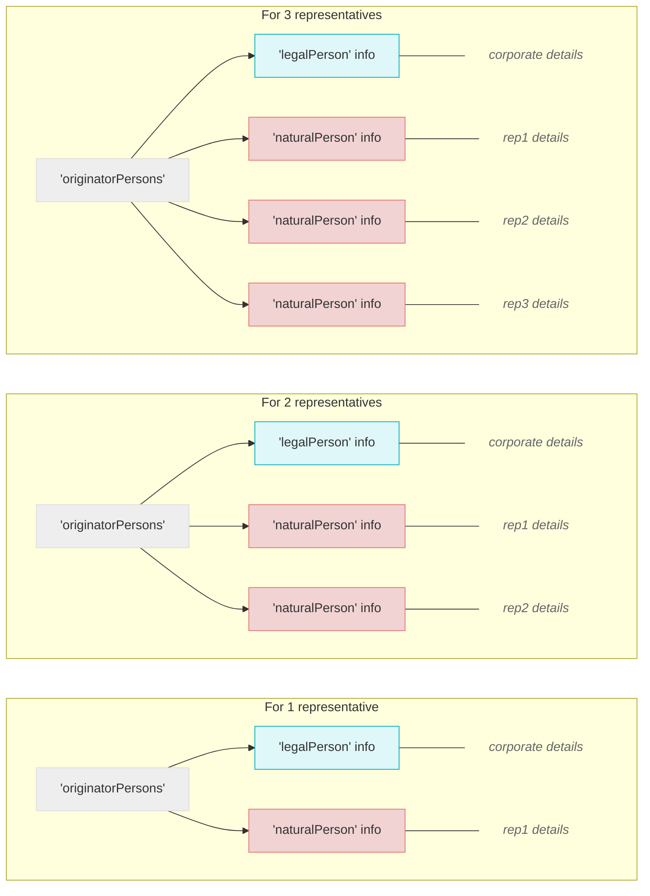
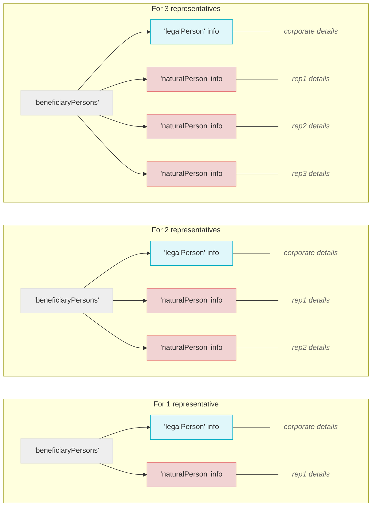

# 03_Creating_Travel_Rule_Objects

* This guide is intended for developers handling Travel Rule data.
## 1. Getting Started
When a legal entity is involved as either the originator or the beneficiary, the structure of the Travel Rule data (messaging protocol IVMS101) changes accordingly.

Before implementing these changes, please review your internal policies related to legal transactions. At a minimum, ensure that your team is fully aligned on the points outlined in [Corporate Travel Rule Policy].

From here, we will go through the process in two parts — handling withdrawals and deposits.

## 2. As an originator
### 2-1. How to build originator object('originatorPersons')
#### Individual (KYC)

#### Legal Entity (KYB)

> [!NOTE] Name field: allowed characters
> - 'legalPerson': special characters and numbers are allowed  
> - 'naturalPerson': special characters and numbers are **not** allowed in names
* The 'originatorPersons' object is built using the corporate information collected during KYB.
* Under 'originatorPersons', include 'legalPerson' to hold corporate information and 'naturalPerson' for the representative's details.
* In cases where there are multiple representatives, include a separate 'naturalPerson' for each individual.
### 2-2. How to build beneficiary object('beneficiaryPersons')
#### Individual(User Input)

#### Legal Entity (User Input)

> [!NOTE] Name field: allowed characters
> - 'legalPerson': special characters and numbers are allowed  
> - 'naturalPerson': special characters and numbers are **not** allowed in names

- The beneficiary object is generally built using user-provided input.
- Please update the withdrawal UI to allow input of multiple representatives, in case there is more than one.
- Under beneficiaryPersons, include 'legalPerson' to store corporate information and 'naturalPerson' to capture the representative's details.
- Add a separate naturalPerson for each representative if there is more than one.

## 3. As a beneficiary
* Check your internal policy on whether transfers between natural persons and legal entities are allowed.
* The format of the originator and beneficiary objects may vary depending on the policy.
* Verify that the legal entity and representative information on 'your' platform matches the Beneficiary data for the Travel Rule before proceeding.
* If your platform has n representatives registered, the Travel Rule data must contain the same number of representative entries, and a full match is required. This is CodeVASP's recommended guideline.